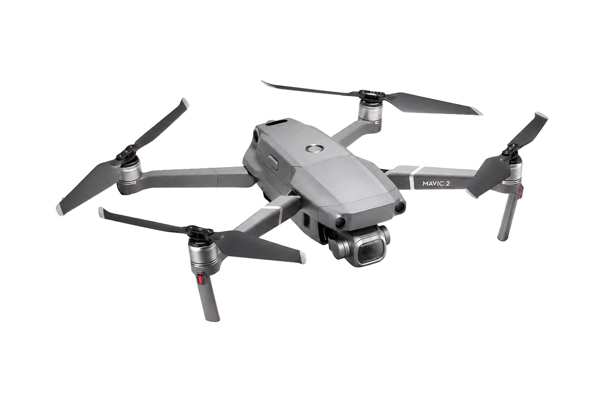

.. GENERATED FROM THE KINESIS VAULT — DO NOT EDIT THIS PAGE DIRECTLY.
.. equipment_id: 1943ef1f-8098-4c96-a198-d674ef7aca25

=========================
Drone - Mavic 2 Pro - DJI
=========================

.. container:: equipment-kicker

   DJI · Mavic 2 Pro

   Drone - Mavic 2 Pro - DJI

.. list-table:: At a glance
   :class: equipment-facts-table
   :widths: 32 68
   :header-rows: 0

   * - **Manufacturer**
     - DJI
   * - **Model**
     - Mavic 2 Pro
   * - **Equipment class**
     - UAV
   * - **Location**
     - C3.B2.029.E (KINESIS CTP)
   * - **Quantity**
     - 1
   * - **Status**
     - Active
   * - **Training**
     - Required
   * - **Risk assessment**
     - Required
   * - **Primary contact**
     - Samuel A. Prieto (sxp8070)

Overview
--------

The DJI Mavic 2 Pro is a compact folding quadcopter with a three-axis-stabilised Hasselblad L1D-20c camera using a 1-inch, 20 MP CMOS sensor. It captures 20 MP still images and 4K video and supports GPS/GLONASS positioning, Return-to-Home, and omnidirectional obstacle sensing for aerial inspection, mapping-data capture, and cinematography.

Specifications
--------------

.. list-table::
   :class: equipment-spec-table
   :widths: 38 62
   :header-rows: 0

   * - **Folded dimensions**
     - 214 x 91 x 84 (L x W x H) mm
   * - **Unfolded dimensions**
     - 322 x 242 x 84 (L x W x H) mm
   * - **Weight**
     - 0.907 kg
   * - **Payload configuration**
     - Integrated Hasselblad L1D-20c camera; no manufacturer-rated external payload
   * - **Maximum speed**
     - 20 m/s
   * - **Maximum wind resistance**
     - 8.1 to 10.6 m/s
   * - **Maximum flight time**
     - 31 min
   * - **Maximum takeoff altitude**
     - 6,000 m
   * - **Operating temperature**
     - -10 to 40 °C
   * - **Sensor type**
     - Hasselblad L1D-20c, 1-inch CMOS, 20 MP effective
   * - **Resolution**
     - Still images 5472 x 3648; video up to 4K (3840 x 2160) at 30 fps
   * - **Frame rate**
     - 24/25/30 fps at 4K; up to 120 fps at FHD
   * - **Maximum video bitrate**
     - 100 Mbps
   * - **Gimbal stabilization**
     - 3-axis stabilization (tilt, roll, pan)
   * - **GNSS**
     - GPS + GLONASS
   * - **Obstacle sensing**
     - Omnidirectional obstacle sensing; lateral sensing operates only in supported flight modes
   * - **Battery energy capacity**
     - 59.29 Wh
   * - **Battery charge capacity**
     - 3,850 mAh
   * - **Internal storage**
     - 8 GB
   * - **Additional specifications**
     - Maximum speed is measured near sea level in no wind in S-mode; maximum flight time assumes no wind at a constant 25 km/h. DJI specifies Level 5 wind resistance (29 to 38 km/h). The 6000 m figure is DJI's maximum takeoff altitude, not an operating-height authorization.
   * - **Output formats**
     - JPEG, DNG, MP4, MOV
   * - **Mobility**
     - Aerial
   * - **Operating environment**
     - Indoor and outdoor
   * - **Sensing modalities**
     - RGB, GPS

Typical workflows
-----------------

1. aerial inspection and site observation
2. aerial mapping data capture
3. cinematic video capture with stabilised gimbal
4. Return-to-Home assisted flight and controlled landing

Software & dependencies
-----------------------

- DJI GO 4
- DJI Assistant 2

Access, training & booking
--------------------------

Hands-on training and review of the SOP and user manual are required before operating. Outdoor operations require a GCAA drone pilot licence and prior EHS coordination.

- **Training:** Hands-on training is required before operation.
- **Risk assessment:** A task-appropriate risk assessment is required before use.

Safety & operating limits
-------------------------

.. warning::

   Key hazards include high-speed propellers (laceration risk) and LiPo battery fire/thermal runaway. Controls include restricting access, operator training, maintaining visual line-of-sight, and maintaining at least a 5 m exclusion zone around spectators. Fly in open areas below 120 m AGL, following local UAV regulations, inspecting propellers/batteries before each flight, and keeping clear of power lines and reflective or magnetic structures. Storage: power off aircraft and RC, remove battery, fit gimbal clamp/cover, fold arms/props; store batteries at 40–65% SoC in a fire-retardant container at 5–40 °C. PPE: long pants, closed-toed shoes, safety glasses.

**Environmental requirements**

- Keep dry
- Restricted operating area

**Operational controls**

- Risk assessment required
- Training required
- PPE required
- Restricted operating area

Keywords
--------

``drone`` · ``UAV`` · ``aerial photography`` · ``survey`` · ``inspection`` · ``outdoor`` · ``portable`` · ``camera`` · ``Hasselblad`` · ``omnidirectional obstacle sensing`` · ``indoor``

.. note::

   For current availability or details not recorded here, contact
   Samuel A. Prieto (sxp8070).
