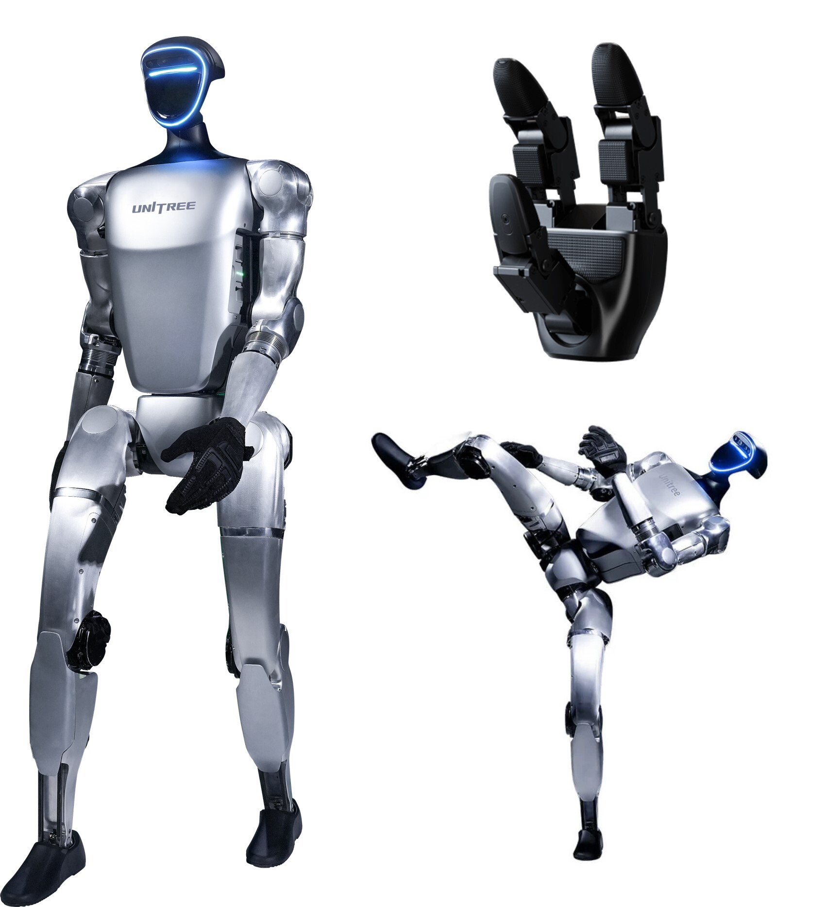

=============================
Humanoid Robot - G1 - Unitree
=============================

   Unitree G1 Humanoid Robot

.. admonition:: Quick Info
   :class: equipment-info

   - **Manufacturer:** Unitree
   - **Model:** G1
   - **Category:** Ground Robot
   - **Location:** C3.B2.029.E (KINESIS CTP)
   - **Contact:** Samuel A. Prieto (sxp8070)

Overview
--------

The Unitree G1 is a compact humanoid robot used for research and demonstrations involving locomotion, dynamic control, and human-robot interaction. It can be operated manually via a wireless handheld remote or programmatically via the Unitree SDK/API over a wired Ethernet connection, using onboard sensors to support balance and control.

Capabilities
------------

- **Mobility:** legged
- **Indoor Outdoor:** both
- **Dof:** 29

**Sensing Modality:**

- rgb
- lidar
- other

Typical Workflow
----------------

1. manual operation via wireless handheld remote for locomotion and demonstrations
2. programmatic control via Unitree SDK/API over wired Ethernet for autonomous tasks
3. research in human-robot interaction, locomotion, dynamic control, and multi-agent tasks

Software Requirements
---------------------

- Unitree SDK
- Unitree API

Compatible Accessories
----------------------

**Inspire Robots RH56 Dexterous Hand**

The G1 humanoid can be equipped with Inspire Robots RH56 dexterous hands for advanced manipulation tasks:

- **Manufacturer:** Inspire Robots
- **Model:** RH56
- **Degrees of Freedom:** Multi-articulated fingers with precision control
- **Grip Types:** Power grip, precision grip, pinch grip
- **Control:** Integrated with Unitree control system
- **Applications:** Object manipulation, human-like grasping, research in dexterous manipulation

Availability Notes
------------------

Only trained and authorised personnel are allowed to operate or programme the robot. Operating area must be clear of obstacles and bystanders with a minimum 2 m radius.

Training Required
-----------------

Yes - hands-on training is required before operating this equipment.

Risk Assessment
---------------

A risk assessment is required before using this equipment.

Safety and Operational Notes
-----------------------------

.. warning::

   - Key hazards: high-torque actuators, stability/fall risk during locomotion, battery fire/burn hazards if damaged, and heat generation after extended use.
   - Maintain ≥2 m safe working radius
   - Never attempt to catch or support the robot if it begins to fall
   - Avoid touching joints/core immediately after use.
   - Emergency stop: L1+A on remote → damping mode
   - If unresponsive, battery button (short + hold >2 s), or manually remove battery.
   - Storage: damping mode, power off, store seated/suspended with support frame in a dry indoor area
   - Remove battery.
   - PPE: long pants, closed-toed shoes.

**Environmental Requirements:**

- No Wet

**Safety Requirements:**

- Risk Assessment Required
- Training Required
- Ppe Required

Tags
----

``humanoid``  
``bipedal``  
``ground robot``  
``legged``  
``Unitree``  
``G1``  
``research``  
``indoor``  

.. note::

   For more detailed information, contact Samuel A. Prieto (sxp8070).
