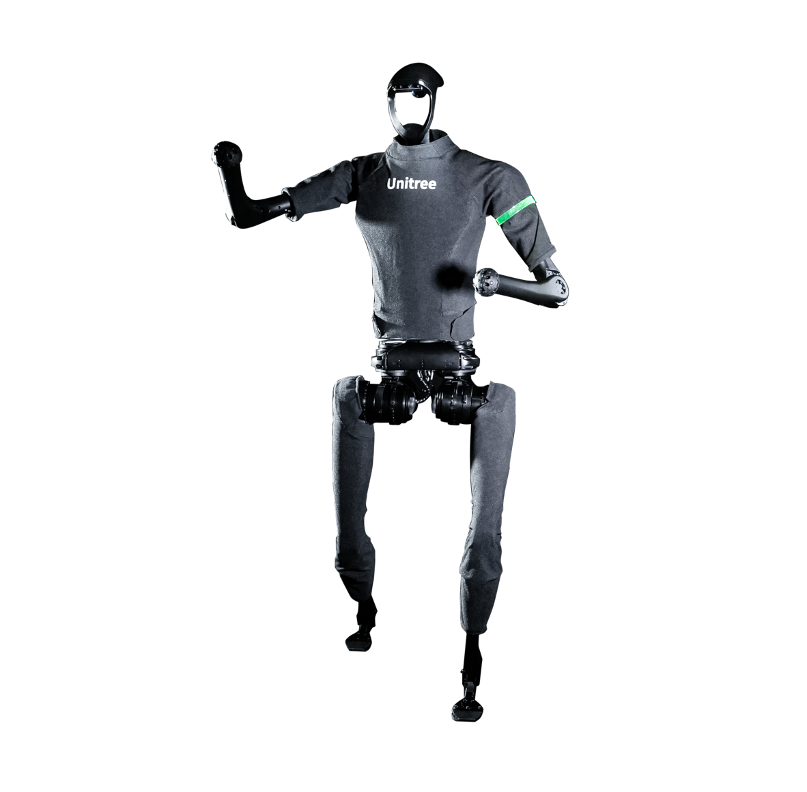

.. GENERATED FROM THE KINESIS VAULT — DO NOT EDIT THIS PAGE DIRECTLY.
.. equipment_id: 0c0c108f-7171-4ea7-bbea-46882ddc78af

===============================
Humanoid Robot - H1-2 - Unitree
===============================

.. container:: equipment-kicker

   Unitree · H1-2

   Humanoid Robot - H1-2 - Unitree

.. list-table:: At a glance
   :class: equipment-facts-table
   :widths: 32 68
   :header-rows: 0

   * - **Manufacturer**
     - Unitree
   * - **Model**
     - H1-2
   * - **Equipment class**
     - Ground Robot
   * - **Location**
     - C3.B2.029.E (KINESIS CTP)
   * - **Quantity**
     - 1
   * - **Status**
     - Active
   * - **Training**
     - Required
   * - **Risk assessment**
     - Required
   * - **Primary contact**
     - Samuel A. Prieto (sxp8070)

Overview
--------

The Unitree H1-2 is a full-sized humanoid robot used for research and public demonstrations involving dynamic locomotion and human-robot interaction. It can be operated manually with a wireless handheld controller or programmatically via the Unitree SDK/API over a wired Ethernet connection, and includes onboard perception sensors for balance and environment awareness.

Specifications
--------------

.. list-table::
   :class: equipment-spec-table
   :widths: 38 62
   :header-rows: 0

   * - **Standing dimensions**
     - H (1503 + 285) x W 510 x D 287 mm
   * - **Height**
     - approximately 1780 mm
   * - **Weight**
     - approximately 70 kg
   * - **Degrees of freedom**
     - 27
   * - **Leg degrees of freedom**
     - 6 per leg
   * - **Waist degrees of freedom**
     - 1
   * - **Arm degrees of freedom**
     - 7 per arm
   * - **Mobility**
     - Legged
   * - **Maximum speed**
     - under 2 m/s
   * - **Operating environment**
     - Indoor and outdoor
   * - **Battery energy capacity**
     - 864 Wh
   * - **Battery charge capacity**
     - 15 Ah
   * - **Maximum voltage**
     - 67.2 V
   * - **Arm load**
     - approximately 7 kg rated; approximately 21 kg peak
   * - **Maximum arm-joint torque**
     - approximately 120 N·m
   * - **Maximum knee-joint torque**
     - approximately 360 N·m
   * - **Processor**
     - Intel Core i5 for platform functions and Intel Core i7 for user development
   * - **Sensor type**
     - Livox MID-360 3D LiDAR and Intel RealSense D435i depth camera
   * - **Sensing modalities**
     - Depth camera, LiDAR

Typical workflows
-----------------

1. manual operation via wireless handheld remote for locomotion demonstrations
2. programmatic control via Unitree SDK/API over wired Ethernet for autonomous tasks
3. community engagement or promotional demonstrations in controlled indoor/outdoor spaces

Software & dependencies
-----------------------

- Unitree SDK
- Unitree API

Access, training & booking
--------------------------

Only trained and authorised personnel are allowed to operate or programme the robot. Operators must remind bystanders not to approach the robot during demonstrations.

- **Training:** Hands-on training is required before operation.
- **Risk assessment:** A task-appropriate risk assessment is required before use.

Safety & operating limits
-------------------------

.. warning::

   Maintain ≥2 m safe working radius around the robot; avoid standing directly in front of or behind it due to stability/fall risk. Emergency stop: press L1+A on remote to enter damping mode (motors power down and robot falls in place); if unresponsive, power off via battery button (short press then press-and-hold >2 s) or remove battery. Only trained personnel handle charging, connection, or battery replacement. Robot uses SELV (<60 VDC) design with system monitoring that alerts/locks on critical faults. Storage: damping mode and power off; do not store standing unsupported — store seated or suspended with a support frame; store dry indoors, remove battery. PPE: long pants, closed-toed shoes.

**Environmental requirements**

- Keep dry

**Operational controls**

- Risk assessment required
- Training required
- PPE required
- Restricted operating area

Related equipment & documentation
---------------------------------

- **Compatible equipment:** :doc:`Dexterous Hand - RH56 - Inspire Robots </2-equipment/ground/dexterous-hand-rh56-inspire-robots>`

Keywords
--------

``humanoid`` · ``bipedal`` · ``ground robot`` · ``legged`` · ``Unitree`` · ``H1-2`` · ``H1`` · ``human-robot interaction`` · ``research``

.. note::

   For current availability or details not recorded here, contact
   Samuel A. Prieto (sxp8070).
