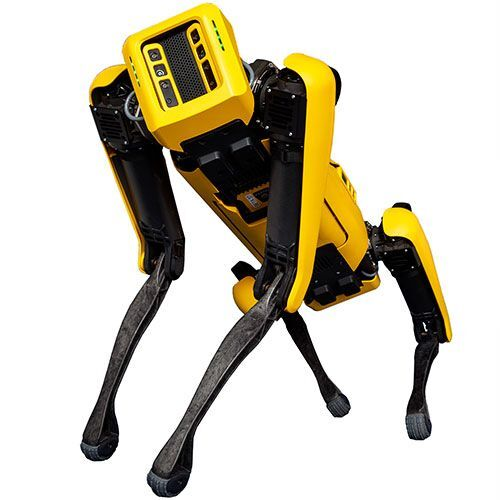

========================================
Quadruped Robot - Spot - Boston Dynamics
========================================

   Boston Dynamics Spot Quadruped Robot

.. admonition:: Quick Info
   :class: equipment-info

   - **Manufacturer:** Boston Dynamics
   - **Model:** Spot
   - **Category:** Ground Robot
   - **Location:** C3.B2.029.E (KINESIS CTP)
   - **Contact:** Samuel A. Prieto (sxp8070)

Overview
--------

The Boston Dynamics Spot is a legged, mobile ground robot used for remote inspection, data collection, and autonomous navigation in indoor and outdoor environments. It can be driven manually with a tablet controller or operated programmatically via the Spot API, and supports a variety of sensor and equipment payloads mounted on its back.

Capabilities
------------

- **Mobility:** legged
- **Indoor Outdoor:** both
- **Battery Life Min:** 90
- **Dof:** 12
- **Max Speed Ms:** 1.6
- **Payload Body Kg:** 14

**Sensing Modality:**

- rgb
- lidar
- thermal
- other

Typical Workflow
----------------

1. Remote teleoperation for indoor/outdoor inspection
2. Autonomous or semi-autonomous navigation with obstacle avoidance
3. Data collection with mounted sensors (cameras, LiDAR, thermal imagers)
4. Recording and replaying missions (Autowalk) with data capture actions
5. Payload-based inspection tasks using the Spot API

Software Requirements
---------------------

- Spot tablet controller app
- Spot API

Availability Notes
------------------

Access restricted to trained and authorised personnel. Minimum 3 m clearance around the robot must be maintained during all operations.

Training Required
-----------------

Yes - hands-on training is required before operating this equipment.

Risk Assessment
---------------

A risk assessment is required before using this equipment.

Safety and Operational Notes
-----------------------------

.. warning::

   - Intended for professional use in industrial, restricted, or controlled environments — not for collaborative applications involving physical interaction with humans.
   - Prohibited uses include underwater/airborne applications, home environments, transporting persons/animals, and transporting hazardous materials.
   - Maintain at least 3 m clearance during all operations.
   - Use slow speed when working near people.
   - Use only Boston Dynamics Spot batteries and chargers.
   - Storage: power off and remove the battery whenever the robot is not in use.
   - Store the robot indoors at -20 °C to 45 °C (IP54).
   - Store batteries at ~50% state-of-charge for long-term storage.

**Environmental Requirements:**

- Restricted Area

**Safety Requirements:**

- Training Required
- Risk Assessment Required
- Ppe Required
- Requires Supervisor
- Restricted Area

Tags
----

``mobile robot``  
``quadruped``  
``ground robot``  
``inspection``  
``indoor``  
``outdoor``  
``autonomous``  
``Spot``  
``legged``  

.. note::

   For more detailed information, contact Samuel A. Prieto (sxp8070).
