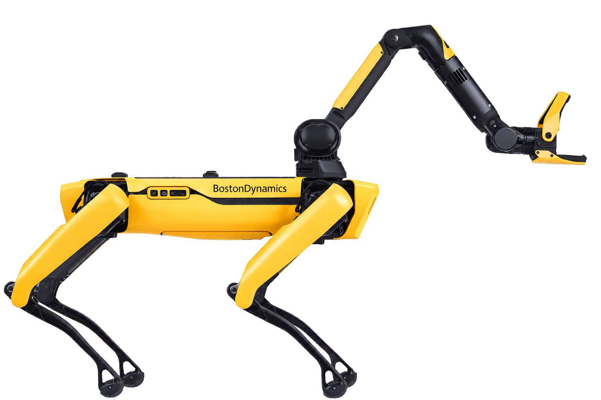

=================================================
Quadruped Robot with Arm - Spot - Boston Dynamics
=================================================

   Boston Dynamics Spot with Robotic Arm

.. admonition:: Quick Info
   :class: equipment-info

   - **Manufacturer:** Boston Dynamics
   - **Model:** Spot
   - **Category:** Ground Robot
   - **Location:** C3.B2.029.E (KINESIS CTP)
   - **Contact:** sxp8070

Overview
--------

The Boston Dynamics Spot with Spot Arm is a legged, mobile ground robot with a 6-DOF manipulator and gripper used for remote inspection and general-purpose manipulation tasks. It can be driven manually with a tablet controller or operated programmatically via the Spot API, and can perform tasks like grasping objects, turning valves, and opening doors in industrial or controlled environments.

Capabilities
------------

- **Mobility:** legged
- **Range Max M:** 2
- **Indoor Outdoor:** both
- **Battery Life Min:** 90
- **Max Speed Ms:** 1.6
- **Payload Body Kg:** 14

**Sensing Modality:**

- rgb
- lidar
- thermal
- other

Typical Workflow
----------------

1. Remote teleoperation for indoor/outdoor inspection
2. Grasping and picking up objects using the gripper
3. Turning/twisting/pulling tasks such as operating valves
4. Opening doors in manual operation or Autowalk missions
5. Recording and replaying missions (Autowalk) with data capture actions

Software Requirements
---------------------

- Spot tablet controller app
- Spot API

Availability Notes
------------------

Operation is covered by the Operation of Ground Robots risk assessment (1450RA) and the Quadruped Demonstration risk assessment (2758RA), both associated with Basement 2, B2 029 (Robotics Lab) and CTP. Each requires digital sign-off by an Authorised User before operation. Access is restricted to trained and authorised personnel. A minimum 3 m clearance around the robot must be maintained during all operations.

Training Required
-----------------

Yes - hands-on training is required before operating this equipment.

Risk Assessment
---------------

A risk assessment is required before using this equipment.

Safety and Operational Notes
-----------------------------

.. warning::

   - Intended for professional use in industrial, restricted, or controlled environments — not for collaborative applications involving physical interaction with humans.
   - Prohibited uses include underwater/airborne applications, home environments, transporting persons/animals, and transporting hazardous materials.
   - Key hazards: pinch/crush risks at arm joints and gripper
   - Loss of stability with extended arm or heavy payloads (>5 kg at 0.5 m extension can unbalance Spot)
   - Unexpected motion during manipulation.
   - Controls: maintain at least 3 m clearance, keep arm stowed when not manipulating, use slow speed when teaching or working near people.
   - Storage: stow the arm, power off and remove the battery, store indoors at -20 °C to 45 °C (IP54)
   - Store batteries at ~50% state-of-charge for long-term storage.

**Environmental Requirements:**

- Restricted Area

**Safety Requirements:**

- Training Required
- Risk Assessment Required
- Ppe Required
- Requires Supervisor
- Restricted Area

Tags
----

``mobile robot``  
``quadruped``  
``ground robot``  
``robotic arm``  
``manipulation``  
``inspection``  
``indoor``  
``outdoor``  
``Spot``  
``legged``  

.. note::

   For more detailed information, contact sxp8070.
