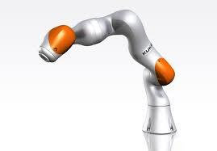

=====================================
Robotic Arm - LBR iiwa 14 R820 - KUKA
=====================================

   KUKA LBR iiwa 14 R820 Robotic Arm

.. admonition:: Quick Info
   :class: equipment-info

   - **Manufacturer:** KUKA
   - **Model:** LBR iiwa 14 R820
   - **Category:** Robot manipulation
   - **Location:** C3.B2.029.E (KINESIS CTP)
   - **Contact:** Samuel A. Prieto (sxp8070)

Overview
--------

The KUKA LBR iiwa 14 R820 is a 7-axis collaborative robotic arm used for research tasks such as assembly, inspection, and human-robot collaboration. It is operated via the KUKA Sunrise Cabinet controller and smartPAD teach pendant, with Java-based applications developed and managed in KUKA Sunrise.OS / Sunrise.Workbench.

Capabilities
------------

- **Mobility:** fixed
- **Accuracy Mm:** 0.15
- **Indoor Outdoor:** indoor
- **Dof:** 7
- **Payload Kg:** 14

Typical Workflow
----------------

1. jogging and teaching motions using the smartPAD
2. running Java-based robot applications via Sunrise.Workbench and the smartPAD
3. assembly, inspection, research, and human-robot collaboration tasks

Software Requirements
---------------------

- KUKA Sunrise.OS
- KUKA Sunrise.Workbench
- WorkVisual 4.0
- Windows 7

Compatible Accessories
----------------------

**Robotiq 3-Finger Adaptive Gripper**

The KUKA LBR iiwa can be equipped with a Robotiq 3-finger adaptive gripper for versatile object manipulation:

- **Manufacturer:** Robotiq
- **Model:** 3-Finger Adaptive
- **Grip Modes:** Pinch, wide wrap, basic modes
- **Force Control:** Adjustable grip force for delicate to firm grasping
- **Applications:** Part handling, assembly, pick-and-place operations

Availability Notes
------------------

Only trained and authorised personnel may programme or run the robot.

Training Required
-----------------

Yes - hands-on training is required before operating this equipment.

Risk Assessment
---------------

A risk assessment is required before using this equipment.

Safety and Operational Notes
-----------------------------

.. warning::

   - Maintain at least 2 m clearance around the arm during automatic motion.
   - Verify the Emergency-Stop and enabling switches before every shift.
   - Run new or edited programs first in Manual Reduced Velocity (T1).
   - Never enter the workspace unless the robot is in T1 or powered down with brakes applied.
   - PPE: long pants, closed-toed shoes.
   - Storage: power off the Sunrise Cabinet, wait for fans and indicators to stop, unplug AC mains, rest the robot in a seated/folded posture with axis brakes engaged
   - Store indoors at 5–33 °C, 20–80% RH, away from vibration and dust.

**Environmental Requirements:**

- Indoor Only

**Safety Requirements:**

- Risk Assessment Required
- Training Required
- Restricted Area

Tags
----

``robotic arm``  
``collaborative robot``  
``cobot``  
``manipulation``  
``KUKA``  
``iiwa``  
``7-axis``  
``indoor``  
``human-safe``  

.. note::

   For more detailed information, contact Samuel A. Prieto (sxp8070).
