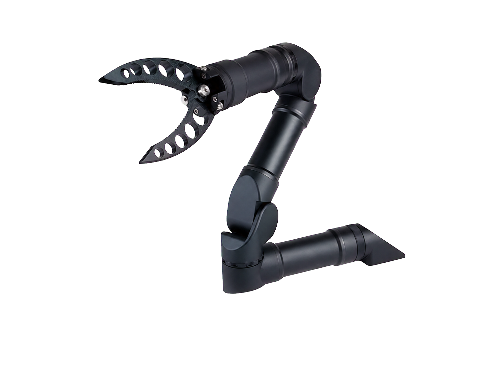

.. GENERATED FROM THE KINESIS VAULT — DO NOT EDIT THIS PAGE DIRECTLY.
.. equipment_id: e8d58251-7799-413a-8c35-b41f31ee815c

==========================================
ROV Robotic Arm - Alpha 5 - Reach Robotics
==========================================

.. container:: equipment-kicker

   Reach Robotics · Alpha 5

   ROV Robotic Arm - Alpha 5 - Reach Robotics

.. list-table:: At a glance
   :class: equipment-facts-table
   :widths: 32 68
   :header-rows: 0

   * - **Manufacturer**
     - Reach Robotics
   * - **Model**
     - Alpha 5
   * - **Equipment class**
     - Robot manipulation
   * - **Location**
     - C3.B2.029.E (KINESIS CTP)
   * - **Quantity**
     - 2
   * - **Status**
     - Active
   * - **Training**
     - Not recorded
   * - **Risk assessment**
     - Required
   * - **Primary contact**
     - Samuel A. Prieto (sxp8070)

Overview
--------

The Reach Robotics Alpha 5 system comprises two five-function subsea manipulators operated through their included RM-5201 master arm controllers for remotely operated vehicle tasks and other underwater manipulation work.

Specifications
--------------

.. list-table::
   :class: equipment-spec-table
   :widths: 38 62
   :header-rows: 0

   * - **Mobility**
     - Robot-mounted
   * - **Functions**
     - 5
   * - **Reach**
     - 400 mm
   * - **Lifting capacity**
     - 2 kg
   * - **Maximum closing force**
     - 600 N
   * - **Weight in air**
     - 1.36 kg
   * - **Weight in water**
     - 0.9 kg
   * - **Joint accuracy**
     - 0.1 °
   * - **Maximum depth**
     - 300 m
   * - **Supply-voltage range**
     - 18 to 30 V
   * - **Maximum power**
     - 35 W
   * - **Interfaces**
     - RS-232, RS-485
   * - **Controller**
     - RM-5201 master arm controller
   * - **System composition**
     - Two Alpha 5 manipulators, each with an RM-5201 master arm controller

Access, training & booking
--------------------------

- **Risk assessment:** A task-appropriate risk assessment is required before use.

Safety & operating limits
-------------------------

**Approved operating area**

- KINESIS CTP Lab, an approved test tank, or an approved KINESIS underwater test area while integrated with its host system.

Operations outside the approved area require a submitted and approved
`Robotics Review Committee (RRC) Mission Review Form <https://docs.google.com/forms/d/e/1FAIpQLSdj0OyfnCpAIcmQqXW_oNY_B6kJzBgunmGXpXxznvEGFAQ2Ew/viewform>`_ before the experiment begins.

**Environmental limits**

- Operate only in the water conditions and depth limits stated in the equipment manual.
- Use only on a compatible host system within the manufacturer's depth, electrical, and environmental limits.

**Operational controls**

- Risk assessment required

Keywords
--------

``robotic arm`` · ``underwater`` · ``ROV`` · ``subsea`` · ``manipulation`` · ``300m depth`` · ``Reach Alpha``

.. note::

   For current availability or details not recorded here, contact
   Samuel A. Prieto (sxp8070).
