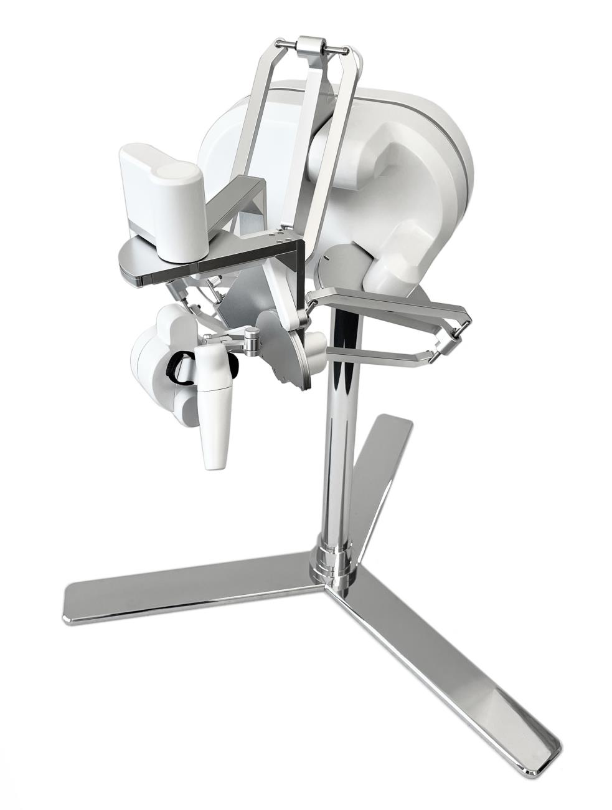

.. GENERATED FROM THE KINESIS VAULT — DO NOT EDIT THIS PAGE DIRECTLY.
.. equipment_id: c73b68e5-8647-4f6f-bdc3-6b3f4dcac5ba

===========================================
Haptic Device - Lambda.07 - Force Dimension
===========================================

.. container:: equipment-kicker

   Force Dimension · lambda.7

   Haptic Device - Lambda.07 - Force Dimension

.. list-table:: At a glance
   :class: equipment-facts-table
   :widths: 32 68
   :header-rows: 0

   * - **Manufacturer**
     - Force Dimension
   * - **Model**
     - lambda.7
   * - **Equipment class**
     - Haptic interface
   * - **Location**
     - C3.B2.029.E (KINESIS CTP)
   * - **Quantity**
     - 1
   * - **Status**
     - Active
   * - **Training**
     - Required
   * - **Risk assessment**
     - Required
   * - **Primary contact**
     - Samuel A. Prieto (sxp8070)

Overview
--------

The Force Dimension lambda.7 is a seven-degree-of-freedom force-feedback haptic interface for teleoperation, human-robot interaction, control, rehabilitation, and virtual-environment research.

Specifications
--------------

.. list-table::
   :class: equipment-spec-table
   :widths: 38 62
   :header-rows: 0

   * - **Mobility**
     - Fixed
   * - **Degrees of freedom**
     - 7
   * - **Translational workspace**
     - diameter 240 x length 170 mm
   * - **Rotational workspace**
     - 180 yaw x 140 pitch x 290 roll °
   * - **Gripper workspace**
     - 15 °
   * - **Maximum translational force**
     - 20 N
   * - **Maximum rotational torque**
     - 200 yaw, 400 pitch, 100 roll mN·m
   * - **Maximum gripper force**
     - +/-8.0 N
   * - **Translational resolution**
     - 0.0015 mm
   * - **Maximum refresh rate**
     - 4,000 Hz
   * - **Interface**
     - USB 2.0
   * - **Power input**
     - 100-240 V AC through the original controller power supply
   * - **Supported platforms**
     - Microsoft Windows, Linux, Apple macOS, Blackberry QNX, Wind River VxWorks

Software & dependencies
-----------------------

- Force Dimension Haptics SDK
- Force Dimension Robotics SDK
- Haptic Desk

Development repositories
------------------------

- `KinesisCTP/lambda-07 <https://github.com/KinesisCTP/lambda-07>`_ — Kinesis CTP onboarding workspace for the Force Dimension Lambda.07 haptic device with ROS 2.

Access, training & booking
--------------------------

Available to trained and authorised users for supervised laboratory work at the designated KINESIS workstation.

- **Training:** Hands-on training is required before operation.
- **Risk assessment:** A task-appropriate risk assessment is required before use.

Safety & operating limits
-------------------------

.. warning::

   - Keep the full device workspace clear before power-up, calibration, or force-enabled operation; the mechanism moves automatically during calibration and must not be touched.
   - Begin user-developed applications at low force and speed settings where practicable, and remain ready to disable force output or power off the controller if movement is unexpected.
   - Use only the original Force Dimension controller power supply and inspect the power, USB, and device cables before use.
   - Do not disassemble the device, remove its panels, or use it when cables, connectors, the enclosure, or motion appear damaged or abnormal.
   - Switch off the device when it is not in use and retain the original packaging for storage or shipment.

**Approved operating area**

- Designated stable work surface in the KINESIS CTP Lab, C3.B2.029.E.

**Environmental limits**

- Indoor, dry operation on a stable work surface with the complete mechanism workspace clear of obstacles.
- Keep the device, controller, power supply, and connections away from water and other liquids.

**Required attire and conditional PPE**

- Lab-appropriate street clothing: long trousers and closed-toed shoes.

**Operational controls**

- Training required
- Risk assessment required

Keywords
--------

``haptic device`` · ``force feedback`` · ``teleoperation`` · ``human-robot interaction`` · ``manipulation`` · ``Force Dimension`` · ``lambda.7``

.. include:: /_includes/contact-lab-manager.inc
