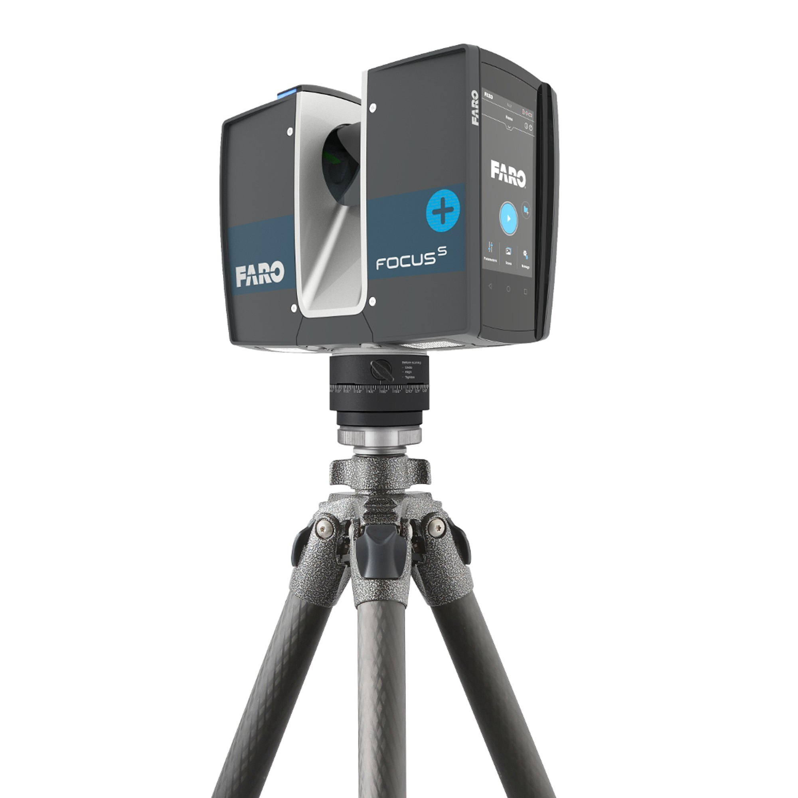

.. GENERATED FROM THE KINESIS VAULT — DO NOT EDIT THIS PAGE DIRECTLY.
.. equipment_id: cc68c58d-4c47-4343-91bb-5215d1863005

===================================
3D Scanner - Focus 350s plus - FARO
===================================

.. container:: equipment-kicker

   FARO · Focus 350s plus

   3D Scanner - Focus 350s plus - FARO

.. list-table:: At a glance
   :class: equipment-facts-table
   :widths: 32 68
   :header-rows: 0

   * - **Manufacturer**
     - FARO
   * - **Model**
     - Focus 350s plus
   * - **Equipment class**
     - 3D Scanning
   * - **Location**
     - C3.B2.029.E (KINESIS CTP)
   * - **Quantity**
     - 1
   * - **Status**
     - Active
   * - **Training**
     - Required
   * - **Risk assessment**
     - Required
   * - **Primary contact**
     - Samuel A. Prieto (sxp8070)

Overview
--------

The FARO Focus S 350 Plus is a terrestrial phase-shift laser scanner used to capture dense 3D point clouds of environments and objects over a wide field of view. It is typically mounted on a tripod and performs 360° scans, optionally capturing high-resolution HDR color imagery, for applications such as as-built surveys, BIM updates, deformation checks, forensic documentation, heritage recording, and wide-area mapping.

Specifications
--------------

.. list-table::
   :class: equipment-spec-table
   :widths: 38 62
   :header-rows: 0

   * - **Output formats**
     - E57, Las, Xyz, Pts, Ptx
   * - **Mobility**
     - Tripod-mounted
   * - **Resolution**
     - Up to 165 megapixel color (HDR 2x/3x/5x); angular step size 0.009° (40,960 3D-Pixel on 360°)
   * - **Accuracy**
     - 1 mm
   * - **Maximum range**
     - 350 m
   * - **Minimum range**
     - 0.6 m
   * - **Operating environment**
     - Indoor and outdoor
   * - **Capture rate**
     - 2,000,000 points/s
   * - **Battery life**
     - 270 min
   * - **Sensing modalities**
     - LiDAR, RGB, GPS

Typical workflows
-----------------

1. Mount the scanner securely on a stable tripod and ensure the head can rotate freely without striking obstacles
2. Insert and manage scan storage on the SD card, then configure scan resolution/quality on the touchscreen or via Wi-Fi control
3. Run 360° × 300° scans and move the scanner to the next station once data are saved to the SD card
4. Transfer scans to SCENE for processing, registration, and downstream CAD/BIM or documentation workflows

Software & dependencies
-----------------------

- SCENE
- WLAN connection (HTML5 access via mobile devices)

Access, training & booking
--------------------------

Only trained and authorised personnel are allowed to operate the sensor. Mobile unit, used on a tripod for indoor and outdoor scanning.

- **Training:** Hands-on training is required before operation.
- **Risk assessment:** A task-appropriate risk assessment is required before use.

Safety & operating limits
-------------------------

.. warning::

   Do not open the housing; dangerously high voltages are present and servicing is for qualified personnel only. Keep hands, tools, and loose clothing clear of the high-speed rotating mirror during scanning and until it stops. Use only on a flat, stable surface/tripod to prevent tipping; maintain an exclusion zone of 0.5 m around the scanner when in use and never reach into the mirror cavity while powered. For outdoor use, power from the battery and protect from rain or spray water; use in a non-condensing environment and shield from dust and strong magnetic/electrical fields. Do not operate while the external power supply is plugged in — the power cable might damage the turning scanner. Insert/remove batteries only in dry, dust-free environments; charge only on the FARO PowerDock in clear, ventilated areas. Follow controlled shutdown before removing power or the battery, and do not remove the SD card while the device indicates it is busy. PPE: appropriate street clothing (long pants, closed-toed shoes).

**Environmental requirements**

- Keep dry
- Dust-sensitive

**Operational controls**

- Training required
- Risk assessment required
- PPE required

- **Software licence:** Required.

Keywords
--------

``lidar`` · ``3d scanning`` · ``laser scanner`` · ``point cloud`` · ``indoor`` · ``outdoor`` · ``tripod`` · ``survey`` · ``architecture`` · ``heritage`` · ``BIM`` · ``e57``

.. note::

   For current availability or details not recorded here, contact
   Samuel A. Prieto (sxp8070).
