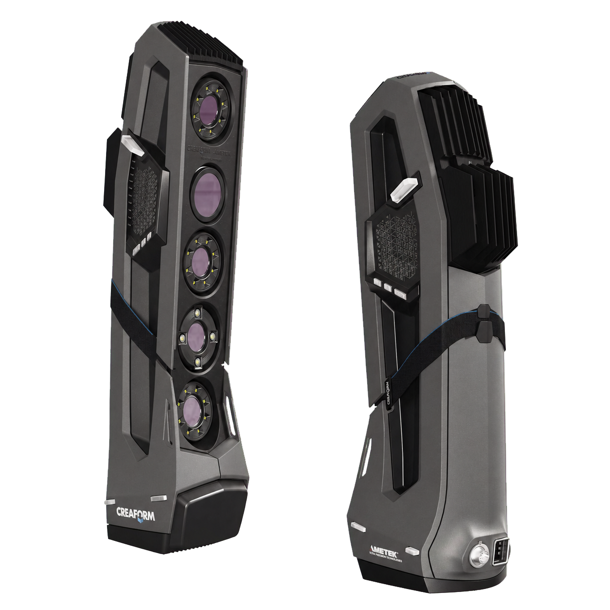

.. GENERATED FROM THE KINESIS VAULT — DO NOT EDIT THIS PAGE DIRECTLY.
.. equipment_id: e2bac7bc-5107-4331-8783-49a221223ece

=====================================
3D Scanner - Go!SCAN SPARK - Creaform
=====================================

.. container:: equipment-kicker

   Creaform · Go!SCAN SPARK

   3D Scanner - Go!SCAN SPARK - Creaform

.. list-table:: At a glance
   :class: equipment-facts-table
   :widths: 32 68
   :header-rows: 0

   * - **Manufacturer**
     - Creaform
   * - **Model**
     - Go!SCAN SPARK
   * - **Equipment class**
     - 3D Scanning
   * - **Location**
     - C3.B2.029.E (KINESIS CTP)
   * - **Quantity**
     - 1
   * - **Status**
     - Active
   * - **Training**
     - Required
   * - **Risk assessment**
     - Required
   * - **Primary contact**
     - Samuel A. Prieto (sxp8070)

Overview
--------

The Creaform Go!SCAN 3D (Go!SCAN SPARK) is a handheld structured-light 3D scanner used to capture full-colour 3D geometry of physical objects as the scanner is swept around a stationary part. It streams live scan data to a computer running Creaform software so researchers can generate meshes for workflows like reverse engineering, inspection/metrology, and preparing models for additive manufacturing.

Specifications
--------------

.. list-table::
   :class: equipment-spec-table
   :widths: 38 62
   :header-rows: 0

   * - **Sensing modalities**
     - RGB, Structured light
   * - **Resolution**
     - Measurement resolution 0.100 mm; mesh resolution 0.200 mm; texture resolution 50–200 DPI
   * - **Capture rate**
     - 1,500,000 points/s
   * - **Accuracy**
     - 0.05 mm
   * - **Scanning area**
     - 390 x 390 mm
   * - **Stand-off distance**
     - 400 mm
   * - **Depth of field**
     - 450 mm
   * - **Recommended part size**
     - 0.1 to 4 m
   * - **Interfaces**
     - USB 3.0
   * - **Mobility**
     - Handheld
   * - **Weight**
     - 1.25 kg
   * - **Operating environment**
     - Indoor
   * - **Output formats**
     - .dae, .fbx, .ma, .obj, .ply, .stl, .txt, .wrl, .x3d, .x3dz, .zpr, .3mf

Typical workflows
-----------------

1. Handheld scanning of stationary objects with real-time mesh build-up
2. Reverse engineering of parts from 3D meshes
3. Quality inspection and metrology using scanned geometry
4. Generating meshes for additive manufacturing
5. Archiving/digitising artefacts

Software & dependencies
-----------------------

- Creaform.OS
- VXelements LTS
- VXmodel EDU

Access, training & booking
--------------------------

Only personnel who have completed the Go!SCAN 3D induction may operate the scanner or handle its power connections.

- **Training:** Hands-on training is required before operation.
- **Risk assessment:** A task-appropriate risk assessment is required before use.

Safety & operating limits
-------------------------

.. warning::

   - To stop the scanner, disconnect the USB 3.0 cable from the laptop or unplug the 18 V in-line adaptor.
   - Route and inspect the 4 m cable to prevent trips and abrasion, and disconnect power before cleaning or changing accessories.
   - Avoid looking directly at the bright structured-light pattern.
   - Take short rest breaks or alternate hands to reduce ergonomic strain.
   - Store the scanner in its padded case with the USB dust cap fitted, and do not touch the calibration-plate targets.

**Environmental limits**

- Operate indoors only.
- Store in a dry indoor area at 5–55 °C and 10–90% non-condensing relative humidity.

**Required attire and conditional PPE**

- Long pants.
- Closed-toed shoes.

**Operational controls**

- Training required
- Risk assessment required
- Supervisor required
- Plan, route, and supervise the tether or cable throughout operation.

Related equipment & documentation
---------------------------------

- **Component or accessory:** :doc:`CRF-01842- ZBook G6 17'' 64Go </3-computing/workstations/creaform-control-laptop>`

Keywords
--------

``3d scanning`` · ``handheld scanner`` · ``structured light`` · ``portable`` · ``reverse engineering`` · ``quality control`` · ``inspection`` · ``indoor``

.. include:: /_includes/contact-lab-manager.inc
