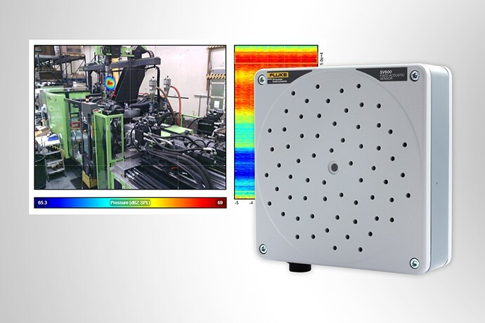

.. GENERATED FROM THE KINESIS VAULT — DO NOT EDIT THIS PAGE DIRECTLY.
.. equipment_id: 53e9b81c-4dc0-48d1-90e3-87d7a88d4c95

===============================
Acoustic Imager - SV600 - Fluke
===============================

.. container:: equipment-kicker

   Fluke · SV600

   Acoustic Imager - SV600 - Fluke

.. list-table:: At a glance
   :class: equipment-facts-table
   :widths: 32 68
   :header-rows: 0

   * - **Manufacturer**
     - Fluke
   * - **Model**
     - SV600
   * - **Equipment class**
     - Camera
   * - **Location**
     - C3.B2.029.E (KINESIS CTP)
   * - **Quantity**
     - 1
   * - **Status**
     - Active
   * - **Training**
     - Required
   * - **Risk assessment**
     - Required
   * - **Primary contact**
     - Samuel A. Prieto (sxp8070)

Overview
--------

The Fluke SV600 Sonic Viewer is an acoustic imaging and monitoring sensor that uses a 64-microphone MEMS array plus an integrated visible-light camera to localize and visualize sound sources. It generates SoundMaps and quantitative acoustic measurements (sound level, spectrum, classification/anomaly detection) for applications such as leak detection, machine-condition monitoring, and environmental noise mapping in lab or field deployments.

Specifications
--------------

.. list-table::
   :class: equipment-spec-table
   :widths: 38 62
   :header-rows: 0

   * - **Sensing modalities**
     - Acoustic, RGB
   * - **Resolution**
     - Integrated visible-light camera: 720p (720 x 1280)
   * - **Frame rate**
     - 30 fps
   * - **Recommended monitoring distance**
     - 3 to 15 m
   * - **Microphone count**
     - 64
   * - **Sound-pressure overload point**
     - 120 dB SPL
   * - **Ingress protection**
     - IP54
   * - **Operating temperature**
     - -20 to 50 °C
   * - **Interfaces**
     - PoE+ Ethernet, HTTP REST API, Modbus
   * - **Mobility**
     - Tripod-mounted
   * - **Weight**
     - 0.85 kg
   * - **Operating environment**
     - Indoor and outdoor
   * - **Output formats**
     - CSV event logs, TXT event logs
   * - **Compatible platforms**
     - Ground Robot - Boston Dynamics Spot, Ground Robot with Robotic Arm - Boston Dynamics Spot, Benchtop, Tripod-mounted

Typical workflows
-----------------

1. Mount on a tripod/bench or via VESA mount; optionally mount as a ground-robot payload
2. Power and connect via a single PoE+ (IEEE 802.3at) Ethernet cable and configure networking (DHCP/Auto IP or static IP)
3. Access the device dashboard via a browser to configure device information, run measurements and SoundMaps, and view live streaming overlays
4. Export event logs as .csv or .txt and download stored measurements/logs from the device

Software & dependencies
-----------------------

- Web browser (Chrome, Firefox, Edge, Safari)

Access, training & booking
--------------------------

Only trained and authorised personnel are allowed to operate the sensor. Mobile unit, can be deployed on a bench, tripod, or as a robot payload.

- **Training:** Hands-on training is required before operation.
- **Risk assessment:** A task-appropriate risk assessment is required before use.

Safety & operating limits
-------------------------

.. warning::

   - Use the imager only as specified for acoustic-signal measurements.
   - Keep the PoE+ port de-energised until the RJ-45 plug is fully connected, route cables safely, and inspect connectors and insulation before each use.
   - For emergency shutdown, disconnect the PoE+ network cable or de-energise the PoE port supplying the SV600.
   - Do not use solvents on the housing or place objects heavier than approximately 5 kg on it.

**Environmental limits**

- Keep the equipment dry; do not operate it in rain, spray, or wet conditions.
- Do not use around explosive gases or vapours, in damp or wet environments, under direct water spray, or in corrosive atmospheres.
- Store indoors in a clean, dry location.

**Required attire and conditional PPE**

- Long pants.
- Closed-toed shoes.

**Operational controls**

- Training required
- Risk assessment required

Keywords
--------

``acoustic imager`` · ``sound camera`` · ``leak detection`` · ``inspection`` · ``indoor`` · ``Fluke`` · ``predictive maintenance``

.. include:: /_includes/contact-lab-manager.inc
