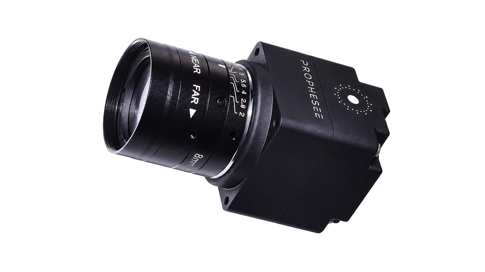

.. GENERATED FROM THE KINESIS VAULT — DO NOT EDIT THIS PAGE DIRECTLY.
.. equipment_id: e9d94a40-9dda-466f-a986-07f3bbfe021c

=============================================
Event Camera - Metavision EVK4 HD - Prophesee
=============================================

.. container:: equipment-kicker

   Prophesee · Metavision EVK4 HD

   Event Camera - Metavision EVK4 HD - Prophesee

.. list-table:: At a glance
   :class: equipment-facts-table
   :widths: 32 68
   :header-rows: 0

   * - **Manufacturer**
     - Prophesee
   * - **Model**
     - Metavision EVK4 HD
   * - **Equipment class**
     - Camera
   * - **Location**
     - C3.B2.029.E (KINESIS CTP)
   * - **Quantity**
     - 2
   * - **Status**
     - Active
   * - **Training**
     - Not recorded
   * - **Risk assessment**
     - Required
   * - **Primary contact**
     - Samuel A. Prieto (sxp8070)

Overview
--------

A high-definition event camera (Metavision® EVK4 – HD) designed by Prophesee, capable of capturing and processing events in real time.

Specifications
--------------

.. list-table::
   :class: equipment-spec-table
   :widths: 38 62
   :header-rows: 0

   * - **Networking**
     - USB3
   * - **Additional specifications**
     - HD IMX636 MP sensor, C-mount lens (81.5° FOV), Metavision Intelligence SDK

Access, training & booking
--------------------------

- **Risk assessment:** A task-appropriate risk assessment is required before use.

Keywords
--------

``event camera`` · ``neuromorphic`` · ``high-speed`` · ``dynamic vision`` · ``camera`` · ``real-time`` · ``Prophesee``

.. note::

   For current availability or details not recorded here, contact
   Samuel A. Prieto (sxp8070).
