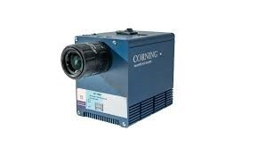

.. GENERATED FROM THE KINESIS VAULT — DO NOT EDIT THIS PAGE DIRECTLY.
.. equipment_id: 8a44b18c-dd10-454c-8899-8758ad436654

====================
Hyperspectral camera
====================

.. container:: equipment-kicker

   Corning Specialty Materials

   Hyperspectral camera

.. list-table:: At a glance
   :class: equipment-facts-table
   :widths: 32 68
   :header-rows: 0

   * - **Manufacturer**
     - Corning Specialty Materials
   * - **Equipment class**
     - Camera
   * - **Location**
     - C3.B2.029.E (KINESIS CTP)
   * - **Quantity**
     - 1
   * - **Status**
     - Active
   * - **Training**
     - Not recorded
   * - **Risk assessment**
     - Required
   * - **Primary contact**
     - Samuel A. Prieto (sxp8070)

Overview
--------

A camera capable of capturing images across a wide range of wavelengths simultaneously, enabling detailed spectral analysis.

Access, training & booking
--------------------------

- **Risk assessment:** A task-appropriate risk assessment is required before use.

Keywords
--------

``hyperspectral`` · ``camera`` · ``spectral analysis`` · ``remote sensing`` · ``multispectral`` · ``imaging``

.. note::

   For current availability or details not recorded here, contact
   Samuel A. Prieto (sxp8070).
