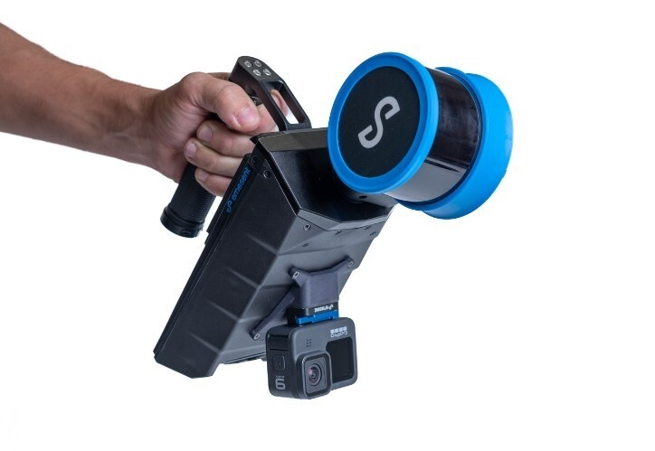

.. GENERATED FROM THE KINESIS VAULT — DO NOT EDIT THIS PAGE DIRECTLY.
.. equipment_id: 6d14d3a9-820d-4940-afba-fba4b0b2a57e

=============================================
LiDAR Mapping Payload - Hovermap ST - Emesent
=============================================

.. container:: equipment-kicker

   Emesent · Hovermap ST

   LiDAR Mapping Payload - Hovermap ST - Emesent

.. list-table:: At a glance
   :class: equipment-facts-table
   :widths: 32 68
   :header-rows: 0

   * - **Manufacturer**
     - Emesent
   * - **Model**
     - Hovermap ST
   * - **Equipment class**
     - 3D Scanning
   * - **Location**
     - C3.B2.029.E (KINESIS CTP)
   * - **Quantity**
     - 1
   * - **Status**
     - Active
   * - **Training**
     - Required
   * - **Risk assessment**
     - Required
   * - **Primary contact**
     - Samuel A. Prieto (sxp8070)

Overview
--------

The Emesent Hovermap ST is a mobile, spinning 360° LiDAR mapping payload that captures 3D point clouds while using onboard SLAM to localise itself in GPS-denied environments. It can be operated handheld, mounted to a robot, or flown under compatible drones to map indoor, outdoor, and underground spaces for surveying and digital-twin generation.

Specifications
--------------

.. list-table::
   :class: equipment-spec-table
   :widths: 38 62
   :header-rows: 0

   * - **Mobility**
     - Handheld, Robot-mounted, Drone-mount
   * - **Maximum range**
     - 100 m
   * - **Minimum range**
     - 0.5 m
   * - **SLAM capable**
     - Yes
   * - **Operating environment**
     - Indoor and outdoor
   * - **Capture rate**
     - 300,000 points/s
   * - **Unit weight**
     - 1.8 kg
   * - **Sensing modalities**
     - LiDAR, RGB

Typical workflows
-----------------

1. Handheld walking scans for indoor mapping
2. Robot-mounted mapping in GPS-denied environments
3. Drone-mounted mapping (indoor, underground, and outdoor asset scans)
4. Processing and merging scans into dense point clouds in Emesent Aura

Software & dependencies
-----------------------

- Emesent Commander
- Emesent Aura

Access, training & booking
--------------------------

Operations occur mainly inside the KINESIS CTP Lab with occasional outdoor field demonstrations. Only trained operators may connect power, start scans, or mount the unit on drones or vehicles.

- **Training:** Hands-on training is required before operation.
- **Risk assessment:** A task-appropriate risk assessment is required before use.

Safety & operating limits
-------------------------

.. warning::

   Power from an external 12–54 V DC source; scans typically <35 minutes, data downloaded to USB. Hazards: electrical shock from damaged leads/connectors (inspect before use, only trained operators connect/disconnect); moving parts from the continuously rotating sensor head (keep hands/hair/clothing clear; use protective cage for handheld use); Class 1 eye-safe lasers (do not open sealed optical enclosure; avoid staring into aperture at close range); dropped-load risk when handheld or drone-mounted (~1.8 kg). IP65 rated but not recommended in rain or fog; maintain ≥10 m from elevated EMI sources; operating temperature -10 °C to 45 °C. Emergency shutdown: hold power button >10 s if frozen, then disconnect battery once LEDs are dark. Storage: indoors dry at 10–30 °C in padded case; fit protective cap; disconnect battery. PPE: long pants, closed-toed shoes.

**Environmental requirements**

- Keep dry
- Tethered operation

**Operational controls**

- Training required
- Risk assessment required
- PPE required

- **Software licence:** Required.

Keywords
--------

``lidar`` · ``3d scanning`` · ``UAV mapping`` · ``SLAM`` · ``drone-mount`` · ``indoor`` · ``outdoor`` · ``point cloud`` · ``Hovermap`` · ``mine mapping``

.. note::

   For current availability or details not recorded here, contact
   Samuel A. Prieto (sxp8070).
