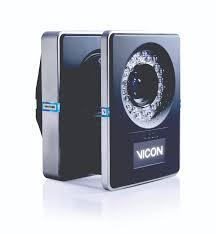

.. GENERATED FROM THE KINESIS VAULT — DO NOT EDIT THIS PAGE DIRECTLY.
.. equipment_id: c06c328c-d453-41ba-8a7d-a876f9dbd4e9

===========================================
Motion Capture System - Vantage V16 - Vicon
===========================================

.. container:: equipment-kicker

   Vicon · Vantage V16

   Motion Capture System - Vantage V16 - Vicon

.. list-table:: At a glance
   :class: equipment-facts-table
   :widths: 32 68
   :header-rows: 0

   * - **Manufacturer**
     - Vicon
   * - **Model**
     - Vantage V16
   * - **Equipment class**
     - Motion capture
   * - **Location**
     - C3.B2.029.E (KINESIS CTP)
   * - **Quantity**
     - 1
   * - **Status**
     - Active
   * - **Training**
     - Required
   * - **Risk assessment**
     - Required
   * - **Primary contact**
     - Samuel A. Prieto (sxp8070)

Overview
--------

The Vicon Vantage V16 is a networked set of 24 infrared optical cameras (16 MP per camera) mounted around a capture volume to track retro-reflective markers and reconstruct 3D motion. Cameras connect via PoE+ Ethernet switches to a host PC running Vicon software (Nexus, Shōgun, or Tracker) for real-time capture, recording, and analysis of movement for applications such as gait analysis, animation, robotics, and engineering studies.

Specifications
--------------

.. list-table::
   :class: equipment-spec-table
   :widths: 38 62
   :header-rows: 0

   * - **Frame rate**
     - 500 fps
   * - **Mobility**
     - Fixed
   * - **Camera count**
     - 24
   * - **Operating environment**
     - Indoor
   * - **Sensing modalities**
     - Mocap
   * - **Camera resolution**
     - 16 MP

Typical workflows
-----------------

1. Installing cameras on overhead rails or tripods and routing PoE+ cabling to switches
2. Calibrating the capture volume using the Vicon Active Wand
3. Live motion capture with IR strobe illumination and marker tracking
4. Recording and exporting motion data for gait analysis, animation, robotics, and engineering studies

Software & dependencies
-----------------------

- Vicon Nexus
- Vicon Shogun
- Vicon Tracker
- VAULT

Access, training & booking
--------------------------

The Vicon manuals are the definitive authority and must be reviewed before each use.

- **Training:** Hands-on training is required before operation.
- **Risk assessment:** A task-appropriate risk assessment is required before use.

Safety & operating limits
-------------------------

.. warning::

   Power via IEEE 802.3at PoE+ (57 V DC): use certified PoE+ switches, inspect Vicon-supplied shielded Cat-5e leads before use, keep ports de-energised until handshake completes ('power-on-last'). Cameras (~1.2 kg) may be ceiling- or tripod-mounted; use approved hardware, torque-check fasteners, strain-relieve cables. IR strobe (850 nm): avoid staring into emitters at close range; brief all visitors. Cameras and strobes warm during prolonged operation — maintain ventilation and do not touch heat-sinks while powered. Emergency shutdown: stop capture in software, switch OFF the PoE+ switch; if unresponsive, unplug the PoE+ switch mains cord and disconnect camera RJ-45 only after LEDs are dark to avoid firmware corruption. Storage: PoE+ switch OFF, coil/secure leads, fit lens caps, store in padded cases in a dry dust-free cabinet (-10 °C to 50 °C); do not stack heavy objects on camera bodies. PPE: long pants, closed-toed shoes.

**Environmental requirements**

- Indoor only

**Operational controls**

- Training required
- Risk assessment required
- PPE required

- **Software licence:** Required.

Related documentation
---------------------

- :doc:`Related system documentation </4-facilities/arena>`

Keywords
--------

``motion capture`` · ``mocap`` · ``tracking`` · ``indoor`` · ``Vicon`` · ``biomechanics`` · ``animation`` · ``marker-based``

.. note::

   For current availability or details not recorded here, contact
   Samuel A. Prieto (sxp8070).
