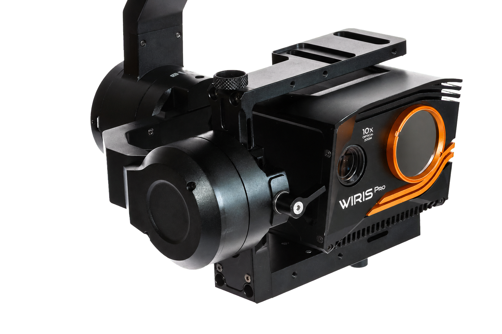

.. GENERATED FROM THE KINESIS VAULT — DO NOT EDIT THIS PAGE DIRECTLY.
.. equipment_id: 310f9228-04d4-4fde-90fe-3284bbd1c86c

================================================
Thermal/Visual Camera - WIRIS Pro SC - Workswell
================================================

.. container:: equipment-kicker

   Workswell · WIRIS Pro SC

   Thermal/Visual Camera - WIRIS Pro SC - Workswell

.. list-table:: At a glance
   :class: equipment-facts-table
   :widths: 32 68
   :header-rows: 0

   * - **Manufacturer**
     - Workswell
   * - **Model**
     - WIRIS Pro SC
   * - **Equipment class**
     - Camera
   * - **Location**
     - C3.B2.029.E (KINESIS CTP)
   * - **Quantity**
     - 1
   * - **Status**
     - Active
   * - **Training**
     - Required
   * - **Risk assessment**
     - Required
   * - **Primary contact**
     - Samuel A. Prieto (sxp8070)

Overview
--------

The Workswell WIRIS Pro SC is a dual-sensor (thermal + visible) radiometric camera for aerial and surface inspection. NOT waterproof — for drone-mount or tripod use only; incompatible with underwater or wet environments. Captures calibrated thermal imagery for heat distribution analysis, energy audits, and non-contact temperature measurement.

Specifications
--------------

.. list-table::
   :class: equipment-spec-table
   :widths: 38 62
   :header-rows: 0

   * - **Sensing modalities**
     - Thermal, RGB
   * - **Sensor type**
     - Uncooled VOx microbolometer
   * - **Thermal resolution**
     - 640 x 512 pixels
   * - **Thermal super-resolution**
     - 1266 x 1010 pixels
   * - **Visible-camera resolution**
     - 1920 x 1080 pixels
   * - **Frame rate**
     - 30 Hz or less than 9 Hz, configuration-dependent
   * - **Spectral range**
     - 7.5 to 13.5 µm
   * - **Measurement temperature range**
     - -25 to 150; -40 to 550 °C
   * - **Optional high-temperature ranges**
     - 50 to 1000; 400 to 1500 °C
   * - **Thermal sensitivity**
     - 30 mK
   * - **Temperature accuracy**
     - ±2% or ±2 °C under specified calibrated conditions
   * - **Dimensions**
     - 83 x 85 x 68 mm
   * - **Supply-voltage range**
     - 9 to 36 V
   * - **Average power consumption**
     - 12 W
   * - **Operating temperature**
     - -15 to 50 °C
   * - **Interfaces**
     - Ethernet (RJ-45), Micro HDMI, USB 2.0, Micro USB 2.0, S.Bus, CAN bus, MAVLink, UART, External trigger
   * - **Mobility**
     - Drone-mount, Tripod-mounted
   * - **Weight**
     - <0.43 kg
   * - **Operating environment**
     - Indoor and outdoor
   * - **Output formats**
     - Radiometric JPEG, Radiometric TIFF, H.264 video, Radiometric full-frame IR recording

Typical workflows
-----------------

1. bench/lab configuration then tripod-based or drone-mounted indoor/outdoor inspections
2. streaming HDMI video to a display or ground station during operation
3. capturing radiometric stills for temperature analysis in CorePlayer/Thermolab
4. recording thermal and visible video to internal storage for later review

Software & dependencies
-----------------------

- Workswell CorePlayer
- Thermolab

Access, training & booking
--------------------------

Drone-mounted operation is restricted to licensed pilots and requires a secured flight zone with a 5 m exclusion radius and overhead hazard warnings.

- **Training:** Hands-on training is required before operation.
- **Risk assessment:** A task-appropriate risk assessment is required before use.

Safety & operating limits
-------------------------

.. warning::

   - Keep the 9–36 V DC SELV supply de-energised until its lead is fully connected, and inspect cables and connectors before use.
   - Internal electronics and the infrared sensor can reach approximately 50 °C; allow at least 15 minutes of cooling after power-down before handling the lens housing.
   - Use the supplied focus tool for lens adjustments.
   - For drone mounting, torque the 1/4-20 UNC mount to specification, inspect it before each deployment, and maintain the approved exclusion zone and warning signs.
   - Use the touchscreen Shutdown command for normal shutdown; disconnect the 9–36 V DC cable only when forced shutdown is necessary.
   - Transport the camera in its original case or a padded ESD-safe container.

**Approved operating area**

- KINESIS CTP Lab or an approved KINESIS controlled test area; drone-mounted use is limited to flight locations approved through the applicable NYUAD EHS and aviation-authority processes.

**Environmental limits**

- Keep the equipment dry; do not operate it in rain, spray, or wet conditions.
- Keep the camera dry and dust-free and do not use it underwater or in wet environments.
- Operate at -15 °C to 50 °C and protect the camera from direct sunlight during storage.

**Required attire and conditional PPE**

- Long pants.
- Closed-toed shoes.

**Operational controls**

- Risk assessment required
- Training required

Keywords
--------

``thermal camera`` · ``infrared`` · ``visual camera`` · ``zoom`` · ``inspection`` · ``drone-mount`` · ``outdoor`` · ``indoor`` · ``thermography``

.. include:: /_includes/contact-lab-manager.inc
