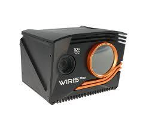

===============================================
Thermal/Visual Camera - Wiris ProSc - Workswell
===============================================

   Workswell Wiris ProSc Thermal/Visual Camera

.. admonition:: Quick Info
   :class: equipment-info

   - **Manufacturer:** Workswell
   - **Model:** Wiris ProSc
   - **Category:** Camera
   - **Location:** C3.B2.029.E (KINESIS CTP)
   - **Contact:** Samuel A. Prieto (sxp8070)

Overview
--------

The Workswell WIRIS Pro SC is a dual-sensor (thermal + visible) radiometric camera for aerial and surface inspection. NOT waterproof — for drone-mount or tripod use only; incompatible with underwater or wet environments. Captures calibrated thermal imagery for heat distribution analysis, energy audits, and non-contact temperature measurement.

Capabilities
------------

**Outputs:**

- jpeg
- tiff
- mp4

- **Mobility:** ['drone-mount', 'tripod']
- **Indoor Outdoor:** both

**Sensing Modality:**

- thermal
- rgb

Typical Workflow
----------------

1. bench/lab configuration then tripod-based or drone-mounted indoor/outdoor inspections
2. streaming HDMI video to a display or ground station during operation
3. capturing radiometric stills for temperature analysis in CorePlayer/Thermolab
4. recording thermal and visible video to internal storage for later review

Software Requirements
---------------------

- Workswell CorePlayer
- Thermolab

Availability Notes
------------------

Drone-mounted operation is restricted to licensed pilots and requires a secured flight zone with a 5 m exclusion radius and overhead hazard warnings.

Training Required
-----------------

Yes - hands-on training is required before operating this equipment.

Risk Assessment
---------------

A risk assessment is required before using this equipment.

Safety and Operational Notes
-----------------------------

.. warning::

   - Powered from 9–36 V DC SELV supply
   - Follow power-on-last rule (keep supply de-energised until DC lead fully connected), visually inspect cables/connectors before use.
   - Internal electronics and IR sensor reach ~50 °C — allow ≥15 min cooldown after power-down before handling the lens housing
   - Use the supplied focus tool for lens adjustments.
   - When drone-mounted, torque 1/4-20 UNC mount to spec and inspect before each deployment
   - Maintain exclusion zones and warning signage.
   - Emergency shutdown: onboard touchscreen Settings → Shutdown
   - Forced: disconnect 9–36 V DC cable.
   - PPE: long pants, closed-toed shoes.
   - Storage: power off, cool ≥15 min, store dry and dust-free, avoid direct sunlight
   - Transport in original case or padded ESD-safe container.

**Environmental Requirements:**

- No Wet

**Safety Requirements:**

- Risk Assessment Required
- Training Required
- Ppe Required

Tags
----

``thermal camera``  
``infrared``  
``visual camera``  
``zoom``  
``inspection``  
``drone-mount``  
``outdoor``  
``indoor``  
``thermography``  

.. note::

   For more detailed information, contact Samuel A. Prieto (sxp8070).
