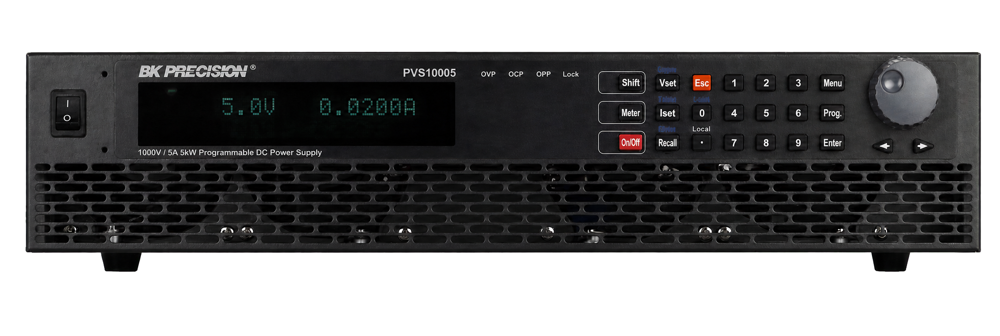

.. GENERATED FROM THE KINESIS VAULT — DO NOT EDIT THIS PAGE DIRECTLY.
.. equipment_id: a8e767a0-0d13-4f27-ac77-6415617a0e49

=======================================
Power Supply - PVS10005 - B&K Precision
=======================================

.. container:: equipment-kicker

   B&K Precision · PVS10005

   Power Supply - PVS10005 - B&K Precision

.. list-table:: At a glance
   :class: equipment-facts-table
   :widths: 32 68
   :header-rows: 0

   * - **Manufacturer**
     - B&K Precision
   * - **Model**
     - PVS10005
   * - **Equipment class**
     - Power supply
   * - **Location**
     - C3.B2.029.E (KINESIS CTP)
   * - **Quantity**
     - 1
   * - **Status**
     - Active
   * - **Training**
     - Required
   * - **Risk assessment**
     - Required
   * - **Primary contact**
     - Samuel A. Prieto (sxp8070)

Overview
--------

The B&K Precision PVS10005 is a high-power programmable single-output DC power supply used to provide controlled high voltage and current for laboratory testing. It delivers up to 1000 V and 5 A (5 kW) and supports constant-voltage and constant-current regulation, programmable protection limits, and ramp/list sequences for test automation.

Specifications
--------------

.. list-table::
   :class: equipment-spec-table
   :widths: 38 62
   :header-rows: 0

   * - **Maximum voltage**
     - 1,000 V
   * - **Maximum current**
     - 5 A
   * - **Maximum power**
     - 5,000 W
   * - **Regulation modes**
     - CV, CC
   * - **Programming / readback resolution**
     - 0.1 V / 0.1 mA
   * - **Ripple / noise**
     - ≤100 mVrms / ≤600 mVpp voltage; 10 mA current
   * - **Remote-sense compensation**
     - 10 V
   * - **Interfaces**
     - Analog programming, USB, RS-232, RS-485, GPIB, Ethernet
   * - **Networking**
     - SCPI over supported remote interfaces
   * - **Dimensions**
     - 420 x 88 x 532 mm
   * - **Mobility**
     - Fixed
   * - **Weight**
     - 14.6 kg
   * - **Operating environment**
     - Indoor

Typical workflows
-----------------

1. Battery emulation at high voltage
2. PV-array simulation
3. High-voltage component burn-in testing
4. Programmable ramps or list/step testing in CV or CC mode
5. Remote control and automation via SCPI over communication interface

Access, training & booking
--------------------------

Equipment-specific training and SOP review are mandatory before operation. "High Voltage" signage must be posted whenever the supply is in use.

- **Training:** Hands-on training is required before operation.
- **Risk assessment:** A task-appropriate risk assessment is required before use.

Safety & operating limits
-------------------------

.. warning::

   Hazards: electrical shock (up to 1000 V at output terminals), arc/flash from loose connections (especially with inductive loads), overheating/fire risk if airflow is blocked, and stored energy in internal capacitors for several seconds after power-down. Controls: verify earth ground; use insulated test leads rated ≥5 A and 1 kV; maintain ≥25 mm clearance at fan sides; enable OVP/OCP limits before connecting a DUT; post 'High Voltage' signage during operation. Emergency shutdown: unplug AC mains cord at rear if power switch is unresponsive; cut facility power at the breaker if damage/smoke/arcing is visible — do not touch output or sense terminals immediately after shutdown as lethal voltages may remain briefly. Storage: disable output, power off and unplug, discharge through a 10 kΩ (≥2 W) resistor for 10 s, fit protective caps on terminals, store indoors at 0–40 °C and ≤90% RH in a dust-free environment.

**Environmental requirements**

- Indoor only
- Keep dry

**Operational controls**

- Training required
- Risk assessment required
- PPE required
- Restricted operating area

Keywords
--------

``power supply`` · ``electronics`` · ``bench equipment`` · ``precision`` · ``indoor``

.. note::

   For current availability or details not recorded here, contact
   Samuel A. Prieto (sxp8070).
