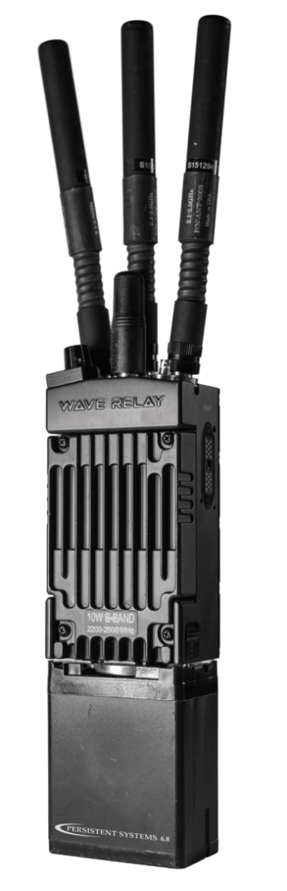

.. GENERATED FROM THE KINESIS VAULT — DO NOT EDIT THIS PAGE DIRECTLY.
.. equipment_id: f5af5e81-02ca-4254-a7ca-04f5f668657c

==========================================
Wireless Radio - MPU5 - Persistent Systems
==========================================

.. container:: equipment-kicker

   Persistent Systems · MPU5 (WR-5100 chassis)

   Wireless Radio - MPU5 - Persistent Systems

.. list-table:: At a glance
   :class: equipment-facts-table
   :widths: 32 68
   :header-rows: 0

   * - **Manufacturer**
     - Persistent Systems
   * - **Model**
     - MPU5 (WR-5100 chassis)
   * - **Equipment class**
     - Communication system
   * - **Location**
     - C3.B2.029.E (KINESIS CTP)
   * - **Quantity**
     - 1
   * - **Status**
     - Active
   * - **Training**
     - Not recorded
   * - **Risk assessment**
     - Required
   * - **Primary contact**
     - Samuel A. Prieto (sxp8070)

Overview
--------

Persistent Systems MPU5 radios form one Wave Relay wireless mesh communication system for long-range links to robots and unmanned platforms.

Specifications
--------------

.. list-table::
   :class: equipment-spec-table
   :widths: 38 62
   :header-rows: 0

   * - **Networking**
     - Wave Relay mobile ad hoc mesh networking using RF-2150 10 W S-band RF modules (2200–2500 MHz acquired configuration)
   * - **Operating frequency**
     - 2200 to 2500 MHz
   * - **Network throughput**
     - over 100 Mbps
   * - **Modulation**
     - OFDM (64-QAM, 16-QAM, QPSK, BPSK)
   * - **Channel bandwidth**
     - 5, 10, or 20 MHz
   * - **Interfaces**
     - Ethernet, USB On-the-Go, RS-232 serial
   * - **Additional specifications**
     - 3x3 MIMO
   * - **Supply-voltage range**
     - 8 to 28 V
   * - **Ingress protection**
     - IP68
   * - **Operating temperature**
     - -40 to 85 °C
   * - **Dimensions**
     - 38 x 67 x 117 mm
   * - **System composition**
     - WR-5100 MPU5 handheld chassis and WR-5200 embedded modules using RF-2150 10 W S-band RF modules
   * - **Weight**
     - 0.391 kg
   * - **Included accessories**
     - Twist-lock battery packs including 6.8 Ah rechargeable lithium-ion packs, GPS antenna, 2.15 dBi omnidirectional antenna with RP-TNC connector, and Ethernet/serial flying leads

Typical workflows
-----------------

1. Long-range wireless links to robots and unmanned platforms
2. Multi-node mesh communication during field operations

Access, training & booking
--------------------------

- **Risk assessment:** A task-appropriate risk assessment is required before use.

Keywords
--------

``wireless`` · ``mesh network`` · ``radio`` · ``transceiver`` · ``communication`` · ``MPU5`` · ``WR-5100`` · ``Wave Relay`` · ``outdoor``

.. note::

   For current availability or details not recorded here, contact
   Samuel A. Prieto (sxp8070).
