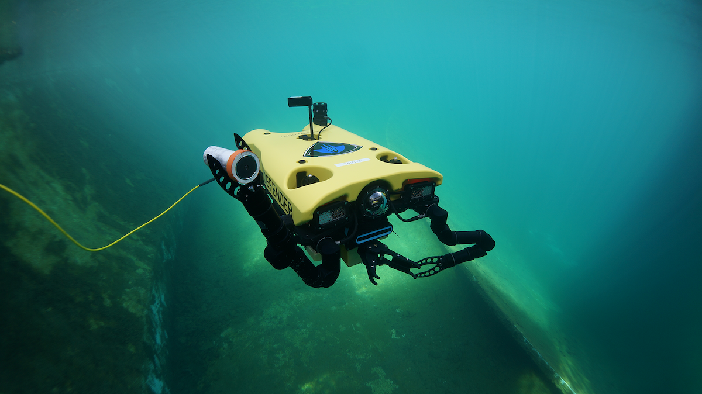

.. GENERATED FROM THE KINESIS VAULT — DO NOT EDIT THIS PAGE DIRECTLY.
.. equipment_id: 4ada61e0-9c75-488f-9aed-bebf2d9ca4c2

====================================
Underwater ROV - Defender - VideoRay
====================================

.. container:: equipment-kicker

   VideoRay · Defender

   Underwater ROV - Defender - VideoRay

.. list-table:: At a glance
   :class: equipment-facts-table
   :widths: 32 68
   :header-rows: 0

   * - **Manufacturer**
     - VideoRay
   * - **Model**
     - Defender
   * - **Equipment class**
     - Underwater Robot
   * - **Location**
     - C3.B2.029.E (KINESIS CTP)
   * - **Quantity**
     - 1
   * - **Status**
     - Active
   * - **Training**
     - Required
   * - **Risk assessment**
     - Required
   * - **Primary contact**
     - Samuel A. Prieto (sxp8070)

Overview
--------

The VideoRay Mission Specialist Defender is a professional-grade tethered ROV designed for open-water inspection and intervention missions — suitable for harbours, docks, rivers, reservoirs, and offshore environments. Rated to 400 m depth with a 500 m tether and 26.7 kgf thrust (6-DOF). Carries cameras, sonar, and optional accessories (DVL, USBL, manipulator). Preferred platform for any mission in exposed or open bodies of water.

Specifications
--------------

.. list-table::
   :class: equipment-spec-table
   :widths: 38 62
   :header-rows: 0

   * - **Degrees of freedom**
     - 6
   * - **Frame rate**
     - 25 fps
   * - **Output formats**
     - H.264
   * - **Mobility**
     - Underwater
   * - **Resolution**
     - Video up to 1920 x 1080; 13 MP still images
   * - **Thrust**
     - 26.7 kgf
   * - **Maximum depth**
     - 400 m
   * - **Operating environment**
     - Indoor and outdoor
   * - **Tether length**
     - 500 m
   * - **Sensing modalities**
     - RGB, Sonar

Typical workflows
-----------------

1. topside setup (console, power supplies, tether) and pre-dive checks
2. launch and recovery in water tanks or open water
3. piloting with live video (and sonar when fitted) for inspection tasks
4. underwater intervention using optional accessories such as a manipulator
5. post-dive rinsing/soaking with fresh water and drying before storage

Software & dependencies
-----------------------

- Greensea IQ control software
- Ubuntu

Access, training & booking
--------------------------

Trained personnel required with role separation: Pilot, Tether Handler, Accessory Operator/Observer. Two-person rule during launch and recovery. PFDs must be worn when working over open water. The official user manual must be consulted before use.

- **Training:** Hands-on training is required before operation.
- **Risk assessment:** A task-appropriate risk assessment is required before use.

Safety & operating limits
-------------------------

.. warning::

   Electrical equipment is used near water; keep power cords, connectors, and console out of the water and handle power cords only with dry hands. Test safety circuits (GFCI and LIM) and verify console-to-ROV interlock before operations. Moving thrusters and optional manipulator create pinch points; keep hands, hair, clothing, and tools clear and disable Auto/Dynamic Positioning before recovery. Manage tether slack and secure strain reliefs to reduce trip/entanglement/snags. For open-water operations, monitor weather/sea conditions and use guardrails/barriers where practical; rescue pole and throw-line should be available near test tanks. After dives (especially saltwater), rinse/soak with fresh water and avoid high-pressure spray; allow equipment to dry fully before storage.

**Environmental requirements**

- Water only
- Tethered operation

**Operational controls**

- Training required
- PPE required
- Two-person operation
- Supervisor required
- Risk assessment required

Keywords
--------

``ROV`` · ``underwater`` · ``subsea`` · ``inspection`` · ``tethered`` · ``Defender`` · ``open water`` · ``deep water`` · ``harbour`` · ``offshore`` · ``river`` · ``robot``

.. note::

   For current availability or details not recorded here, contact
   Samuel A. Prieto (sxp8070).
