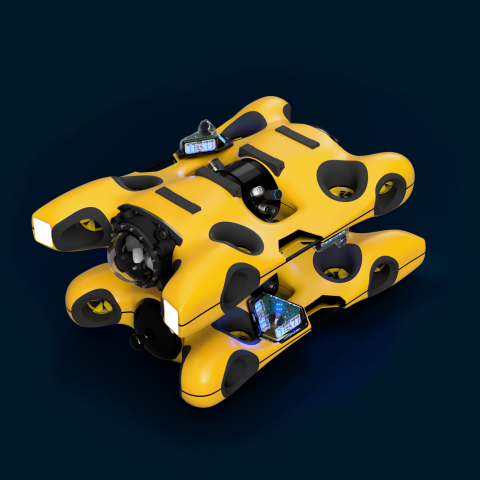

.. GENERATED FROM THE KINESIS VAULT — DO NOT EDIT THIS PAGE DIRECTLY.
.. equipment_id: d2818ca9-767c-4fe1-8a8f-d72321642fc1

=================================
Underwater ROV - EXRAY - Hydromea
=================================

.. container:: equipment-kicker

   Hydromea · EXRAY

   Underwater ROV - EXRAY - Hydromea

.. list-table:: At a glance
   :class: equipment-facts-table
   :widths: 32 68
   :header-rows: 0

   * - **Manufacturer**
     - Hydromea
   * - **Model**
     - EXRAY
   * - **Equipment class**
     - Underwater Robot
   * - **Location**
     - C3.B2.029.E (KINESIS CTP)
   * - **Quantity**
     - 1
   * - **Status**
     - Active
   * - **Training**
     - Required
   * - **Risk assessment**
     - Required
   * - **Primary contact**
     - Samuel A. Prieto (sxp8070)

Overview
--------

The Hydromea EXRAY is a compact two-ROV system optimised for confined and enclosed underwater spaces, including ship ballast tanks, pontoons, storage tanks, flooded cavities, and complex internal structures. Its two ROV bodies are identical and interchangeable. In paired operation, whichever body is connected to the 100 m topside tether and carries the powered Docking Station acts as the primary relay; the other carries the passive Docking Rail and operates as the tetherless FLYOUT over LUMA. Either body can assume either role. The wireless FLYOUT configuration is not intended for open-water operation.

Specifications
--------------

.. list-table::
   :class: equipment-spec-table
   :widths: 38 62
   :header-rows: 0

   * - **Degrees of freedom**
     - 6
   * - **Output formats**
     - .mkv, .jpeg, .raw
   * - **Mobility**
     - Underwater
   * - **Maximum depth**
     - 100 m
   * - **Deployment environment**
     - Confined spaces
   * - **Operating environment**
     - Indoor and outdoor
   * - **Tether length**
     - 100 m
   * - **Sensing modalities**
     - RGB, Sonar
   * - **System composition**
     - Two identical and interchangeable EXRAY ROV bodies
   * - **Role assignment**
     - Dynamic by tether connection and installed Docking Station or Docking Rail

Typical workflows
-----------------

1. Operating either ROV body as the tethered primary relay for confined-space inspection
2. Operating either ROV body as the tetherless FLYOUT via the LUMA optical link
3. Object interaction using optional payloads (gripper, vacuum cleaner)

Software & dependencies
-----------------------

- NAVIA

Access, training & booking
--------------------------

Requires hands-on training and authorisation. Minimum two-person rule during all operations. PFDs must be worn during field deployments.

- **Training:** Hands-on training is required before operation.
- **Risk assessment:** A task-appropriate risk assessment is required before use.

Safety & operating limits
-------------------------

.. warning::

   Key hazards: rotating thrusters (injury/pinch when armed), tether trip/entanglement (MBS 155 kgf), LiPo thermal runaway if damaged or mis-charged, loss of control leading to collision, and drowning risk at the water's edge. Controls: keep ≥1 m clear of thrusters when armed; disarm before lifting/transport; dedicated tether management; inspect connectors and O-rings visually; power-on-last rule; restrict deployment to currents ≤2 knots with suitable visibility. PPE: long pants, closed-toed shoes, and a PFD when working near open water.

**Environmental requirements**

- Water only
- Tethered operation

**Operational controls**

- Risk assessment required
- Training required
- PPE required
- Two-person operation

Keywords
--------

``ROV`` · ``underwater`` · ``subsea`` · ``inspection`` · ``tethered`` · ``EXRAY`` · ``robot`` · ``confined space`` · ``ballast tank`` · ``enclosed space`` · ``tank inspection`` · ``compact``

.. note::

   For current availability or details not recorded here, contact
   Samuel A. Prieto (sxp8070).
