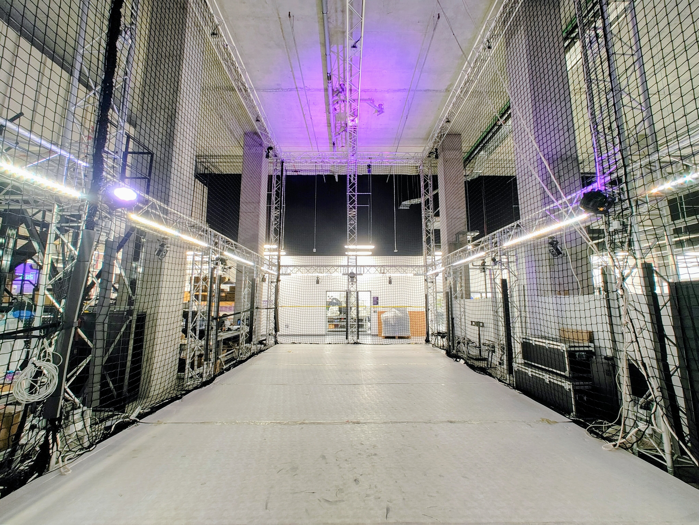
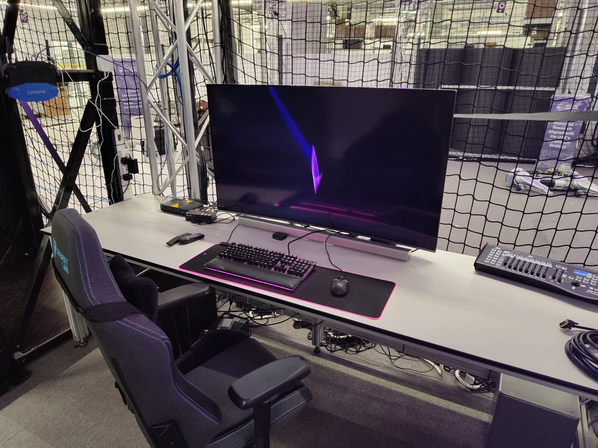
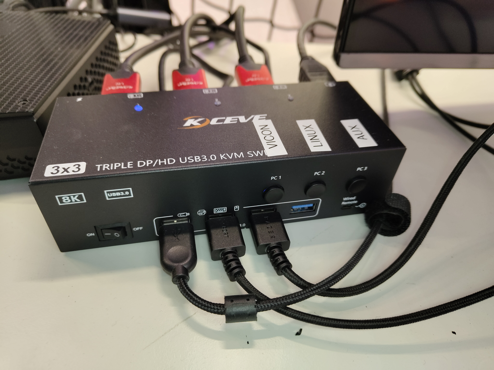

======
Arena
======

The Arena is the KINESIS CTP Lab's enclosed experimental area for tracked
motion, mobile robotics, aerial systems, and other activities that need a large,
controlled operating volume. Its safety-net enclosure separates active
experiments from the adjacent Workspace while preserving visibility for
operators and observers.

   KINESIS CTP Arena

Physical Space
--------------

.. list-table::
   :class: equipment-facts-table
   :widths: 30 70
   :header-rows: 0

   * - **Motion-capture volume**
     - Approximately 17 m × 6.4 m × 8 m
   * - **Enclosure**
     - Safety netting around the active experimental area
   * - **Overhead infrastructure**
     - Adaptable truss structure supporting fixed arena systems
   * - **Floor**
     - Removable modular padding over a hard floor
   * - **Lighting**
     - Adjustable arena lighting for experimental and recording conditions

Configurable Flooring
---------------------

The modular padded floor can remain in place for drone experiments, where it
helps protect equipment during hard landings or falls. It can be removed for
ground-robot experiments that require a hard, level surface. The flooring
configuration should be agreed before setup so that the Arena is prepared for
the planned activity.

Installed Infrastructure
------------------------

The Arena includes fixed systems supporting tracking, communications, lighting,
and audiovisual workflows:

- The :doc:`Vicon Vantage V16 motion-capture system
  </3-equipment/sensors/motion-capture-system-vantage-v16-vicon>` provides
  marker-based position tracking throughout the capture volume. System
  architecture and operating guidance are maintained in the
  :doc:`Vicon System documentation </4-computing/vicon-system/index>`.
- The :ref:`Hermes network <hermes-network>` distributes
  real-time Vicon position data to approved robots, drones, and computers.
- Adjustable smart lighting supports repeatable lighting conditions. The
  facility lighting controls are described on the :doc:`Workspace <workspace>`
  page.
- Projection and sound systems are available for experiments, demonstrations,
  and presentations.

Supported Activities
--------------------

The space supports activities such as:

- Indoor flight and aerial-robot testing
- Mobile-robot and multi-robot experiments
- Autonomous navigation and control research
- Motion capture for robotics, biomechanics, and human movement
- Human-robot interaction studies
- Demonstrations that require a separated operating area

Each activity remains subject to the training, risk-assessment, and safety
controls applicable to the equipment, people, and planned experiment.

Vicon Command Center
--------------------

The Vicon Command Center is positioned beside the Arena, outside the safety-net
enclosure. It provides a protected operator position for monitoring experiments,
controlling the motion-capture system, and accessing the lab's specialist
computers.

   Vicon Command Center

The command center contains three specialist workstations:

- The :doc:`Vicon Host PC </4-computing/workstations/vicon-pc>` runs the
  motion-capture system.
- The :doc:`Dual-Boot Workstation
  </4-computing/workstations/dual-boot-workstation>` normally runs Ubuntu for
  robotics and Vicon client workflows, with Windows available when required.
- The :doc:`DGX Spark </4-computing/workstations/dgx-spark>` supports AI
  development and accelerated computing.

A KVM (keyboard, video, and mouse) switch shares the command center's main
display and input devices between the following connections:

- **Input 1 — Vicon system:** the Intel NUC 11 Enthusiast Vicon Host PC.
- **Input 2 — Dual-boot workstation:** the custom-built Ubuntu and Windows
  workstation.
- **Input 3 — Auxiliary:** a spare connection for a laptop or other temporary
  computer.

The DGX Spark is located at the command center but is not connected to the KVM.

   Vicon Command Center KVM switch

Planning Arena Work
-------------------

- Use the :doc:`Arena Setup Guide
  </4-computing/vicon-system/arena-setup>` when preparing a tracked experiment.
- Review :doc:`Arena safety requirements <safety>` before operating robots or
  aerial systems inside the enclosure.
- Check the relevant equipment page for training, risk-assessment, attire, PPE,
  and operating requirements.
- Follow General Policies for access, authorization, data, and
  routine lab use.
