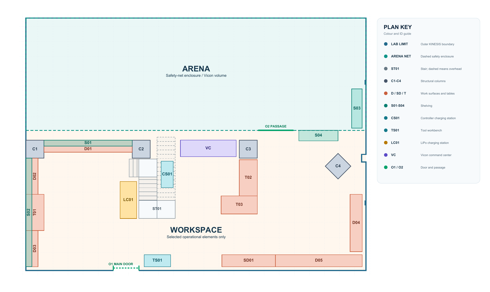

==========
Facilities
==========

The KINESIS CTP Lab features dedicated spaces for experimentation, development, motion tracking, and operational safety.

- **Arena** — motion experimentation and robotics testing
- **Workspace** — development, prototyping, and computational workflows

Spaces at a Glance
------------------

- :doc:`arena` supports motion capture, robot testing, drone-safe experiments, and tracked motion studies.
- :doc:`workspace` supports development, prototyping, electronics work, storage, charging, and workstation access.
- :doc:`safety` covers lab rules, PPE, emergency procedures, risk assessments, and incident reporting.

.. _main-lab-floorplans:

Main Lab Floor Plans
--------------------

These plans show the recorded arrangement of the KINESIS Main Lab in room
``B2-C3-029.E``. They are operational reference drawings derived from the IFC
shell and the scale-corrected Hovermap E57 survey dated 23 July 2026. They are
not construction-survey drawings. Select either plan to open its full-resolution image.

Lab Layout
^^^^^^^^^^

   KINESIS Main Lab operational layout, Classified Draft 09 (23 July 2026).

Fire-Safety Layer
^^^^^^^^^^^^^^^^^

.. figure:: ../_static/images/facility-main-lab-floorplan-fire-safety.png
   :alt: KINESIS Main Lab plan with two fire extinguishers and two fire blankets
   :width: 100%
   :align: center

   The operational layout with recorded fire-extinguisher and fire-blanket locations.

Before Working in the Space
---------------------------

- Confirm whether your activity belongs in the Arena or Workspace.
- Review the relevant safety requirements before moving equipment.
- Keep walkways, emergency exits, and charging areas clear.

.. toctree::
   :maxdepth: 1
   :caption: Facilities
   :hidden:

   arena
   workspace
   safety
