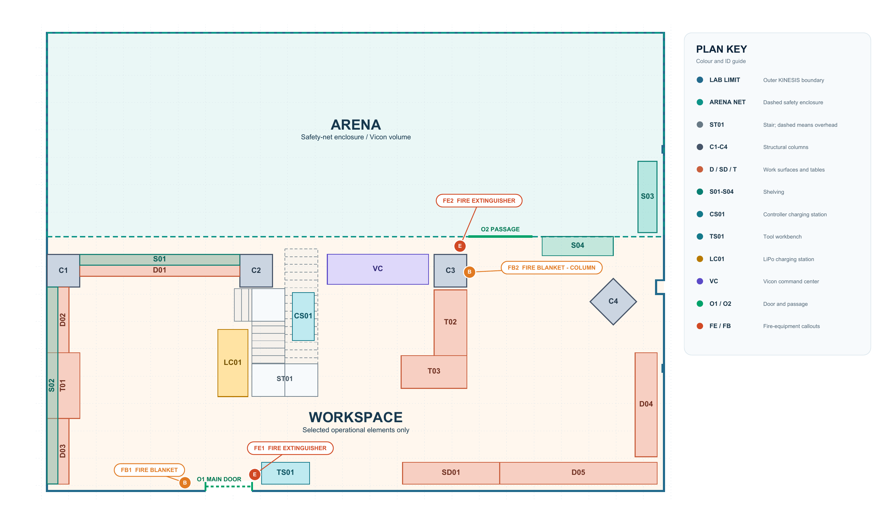

======
Safety
======

This page summarizes the controls that apply across the KINESIS CTP Lab. Before
work begins, review the relevant equipment page, Risk Assessment (RA),
applicable Standard Operating Procedure (SOP), manufacturer instructions, and
any experiment-specific controls. The most restrictive applicable requirement
takes precedence.

Essential Safety Controls
-------------------------

- Complete the training and reading listed in the `KINESIS CTP Lab Safety
  Training and Risk Assessment Acknowledgment
  <https://docs.google.com/forms/d/e/1FAIpQLSedhNihcdGHRwOLP31qAJ1eh_-v9jVnkLZiu3h1ZsYwxtNNlg/viewform>`_
  before lab access, and complete equipment-specific training before operation.
- Work only within the operating area and conditions approved for the equipment
  and planned activity.
- Follow posted instructions, warning signs, RAs, SOPs, and manufacturer
  guidance.
- Wear the exact attire and Personal Protective Equipment (PPE) specified for
  the activity.
- Inspect equipment, accessories, cables, guards, and emergency controls before
  use. Do not use damaged or unsafe equipment.
- Keep emergency exits, access routes, fire blankets, extinguishers, charging
  stations, and work surfaces clear.
- Report incidents, near-misses, unsafe conditions, and equipment damage
  immediately.

The :doc:`equipment index </3-equipment/index>` links to the operating area,
training, attire, PPE, RA, SOP, and model-specific controls recorded for each
system.

Operating Areas
---------------

The :doc:`Arena <arena>` is the enclosed operating area for aerial systems,
mobile robots, tracked motion, and experiments requiring a separated volume.
The :doc:`Workspace <workspace>` supports software development, electronics,
prototyping, equipment preparation, charging, storage, and controlled
workbench tasks.

- Establish the exclusion zone, safety perimeter, netting configuration,
  warning signs, and operator positions required by the equipment RA.
- Keep emergency stops and other safety controls accessible throughout the
  activity.
- Complete documented pre-use checks, including guards, failsafes, payload
  security, and control links where applicable.
- Keep people who are not required for the activity outside the controlled
  operating area.

The equipment page and RA define the approved area for each system. Robotics
work outside an approved operating area also requires submission and approval
of the `Robotics Review Committee (RRC) Mission Review Form
<https://docs.google.com/forms/d/e/1FAIpQLSdj0OyfnCpAIcmQqXW_oNY_B6kJzBgunmGXpXxznvEGFAQ2Ew/viewform>`_
before the experiment begins.

Equipment and Workshop Safety
-----------------------------

- Verify electrical ratings, power sources, connectors, and circuit protection
  before energizing equipment.
- Keep liquids and loose objects away from electrical equipment and moving
  mechanisms.
- Use guards, restraints, mounting hardware, lifting methods, and load limits
  specified for the equipment and task.
- Stop work and notify the lab manager if equipment, wiring, connectors,
  guarding, or emergency controls are damaged or behave unexpectedly.
- Use the soldering, rotary-tool, precision-tool, and general tool stations only
  for tasks covered by the applicable training and safety documents.

The :doc:`Workspace <workspace>` page identifies the charging, storage, and
workshop stations and describes the required clean handover condition.

.. _facilities-battery-safety:

Battery Safety
--------------

- Charge LiPo and Li-ion batteries only at the
  :ref:`LiPo battery charging station <lipo-battery-charging-station>`, using an
  approved charger and under supervision. The charging station is not a
  storage area.
- Store each battery in the location and protective container assigned for its
  battery type and equipment.
- Do not use or charge a battery that is swollen, damaged, leaking, hot, deeply
  discharged, or otherwise suspect.
- If a suspect battery is cool and stable, protect its terminals if this can be
  done safely, label and isolate it from normal stock, and notify the lab
  manager. Do not place lithium batteries in general waste.
- Email `NYUAD Facilities <mailto:nyuad.facilities@nyu.edu>`_ to coordinate
  disposal.

Review the `Charging Rechargeable Batteries RA (3556RA)
<../_static/onboarding-documents/f8645e5ae6995732f27e4185af19b353ef4fc7e10ba560f9481e5b0ffe8b124d.pdf>`_
and the `Lithium Battery Management SOP
<../_static/onboarding-documents/53eaeae125c0cdb7f084c31f740eb03d14d6cb2744e1b3394a1932040320664e.pdf>`_
before charging, storing, handling, or disposing of lithium batteries.

.. _fire-safety-equipment:

Fire Safety Equipment
---------------------

The fire-safety layout marks the locations of the lab's fire extinguishers and
fire blankets.

   KINESIS CTP Lab fire-safety equipment layout

The marked emergency equipment comprises:

- **FE1** — fire extinguisher beside the main entrance.
- **FE2** — fire extinguisher beside the passage between the Workspace and
  Arena.
- **FB1** — fire blanket near the main entrance.
- **FB2** — fire blanket at the Arena entrance column.

.. list-table::
   :widths: 50 50
   :header-rows: 0

   * - .. image:: ../_static/images/facility-fire-extinguishers-fe2.jpg
          :alt: Fire extinguishers at FE2 beside the passage between the Workspace and Arena
          :width: 100%
     - .. image:: ../_static/images/facility-fire-blanket.jpg
          :alt: Fire blanket at FB1 near the main entrance
          :width: 100%
   * - *Fire extinguishers at FE2*
     - *Fire blanket at FB1*

Keep all emergency equipment visible and accessible. Do not remove or relocate
fire blankets or extinguishers.

For smoke, fire, battery venting, hissing, rapid heating, or leakage:

1. Do not handle the battery, open a charging container, or attempt to move it.
2. Alert everyone nearby, evacuate, and activate the fire alarm.
3. Call emergency services and NYUAD Campus Safety.
4. Use a fire blanket or extinguisher only if trained, the fire is still
   incipient, a clear exit remains behind you, and the applicable emergency
   procedure permits it.

Emergency Response and Incident Reporting
-----------------------------------------

1. Stop the activity and use the emergency stop if applicable and safe to do
   so.
2. Alert people in the area and evacuate when required.
3. Call **999** for police, fire, or life-threatening emergencies in the UAE.
   Call `NYUAD Campus Safety
   <https://nyuad.nyu.edu/en/campus-life/housing-and-accommodation/campus-security.html>`_
   at **+971 2 628 7777** for on-campus assistance.
4. Do not resume work or re-enter a controlled area until authorized.
5. After the immediate hazard is controlled, notify the lab manager and report
   the incident, near-miss, unsafe condition, or equipment damage.

Risk Assessments and Safety Documents
-------------------------------------

Every equipment item has a baseline RA for its approved use. Start with the
individual equipment page and review every document listed for the system and
planned activity.

A supplementary, experiment-specific RA is required when the work introduces a
new hazard or materially changes the approved configuration, payload,
material, operating area, human interaction, environment, or control measure.
Contact the lab manager and complete that assessment before work begins.

The current general lab, shared-activity, and equipment RAs, together with the
Lithium Battery Management SOP, are available on the :doc:`Safety Documents for
the KINESIS Lab </1-lab-overview/safety-documents>` page.

Training and Authorization
--------------------------

Required preparation depends on the equipment and activity. It may include:

- General lab safety orientation and access approval.
- Equipment-specific training and recorded attendance.
- Review and acknowledgment of the applicable RAs, SOPs, and manufacturer
  instructions.
- Task-specific instruction covering controls, emergency response, attire, and
  PPE.

.. important::

   Training on one system does not authorize operation of another system or
   work outside the approved operating area and conditions.

Contact and Support
-------------------

.. include:: /_includes/contact-lab-manager.inc
