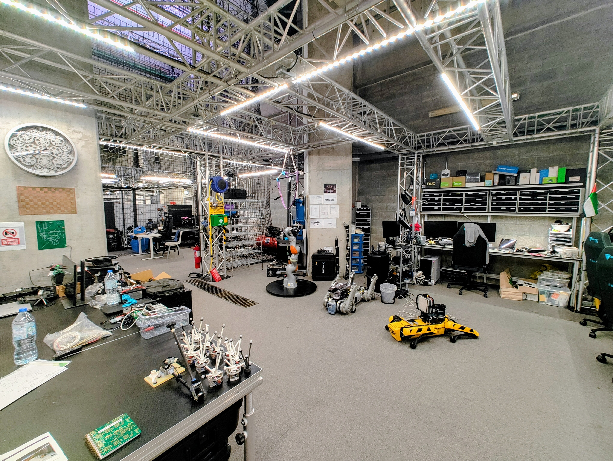
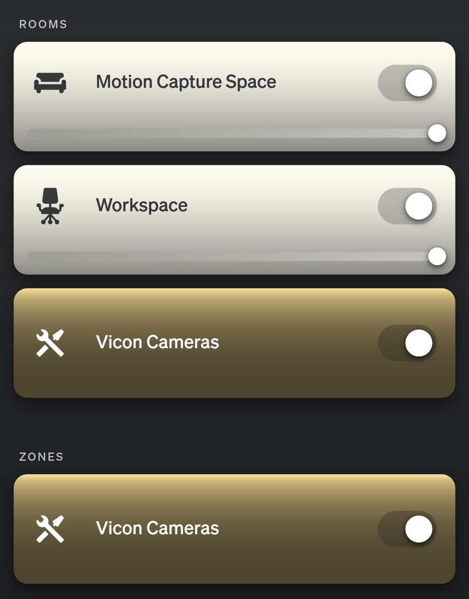
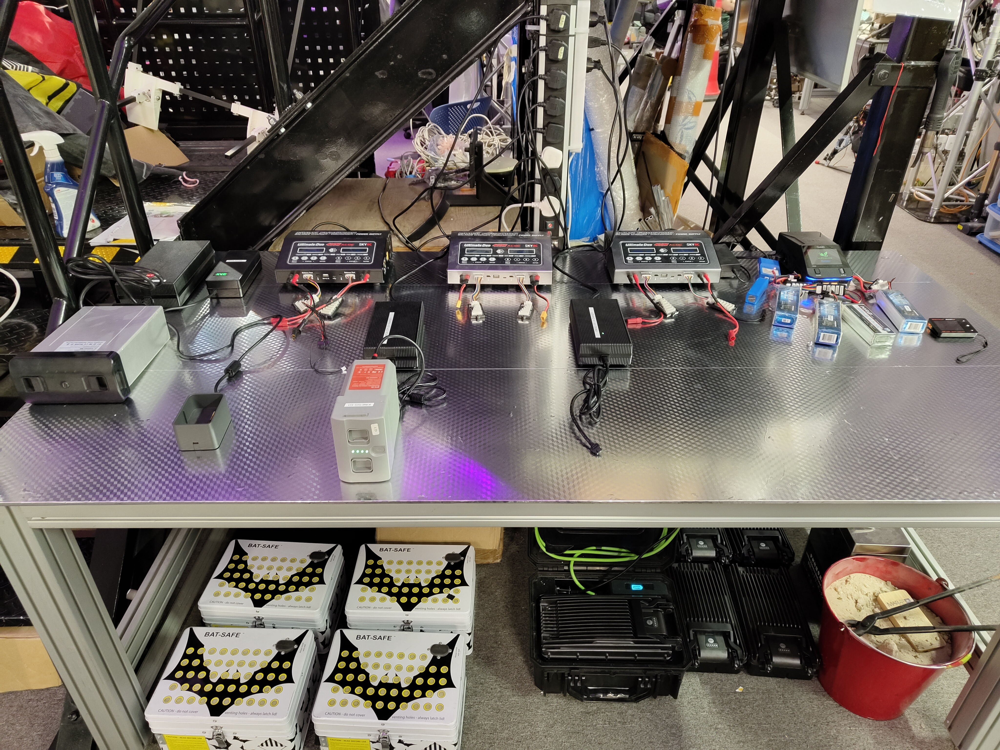
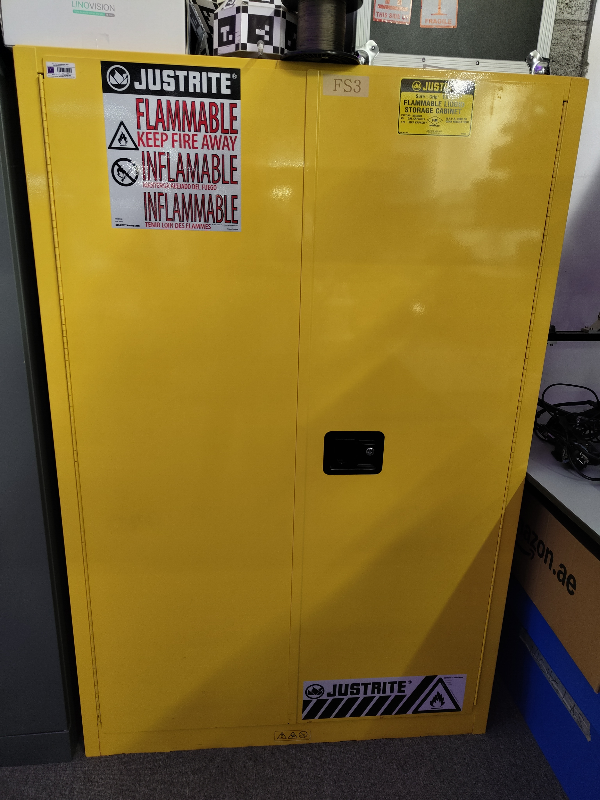
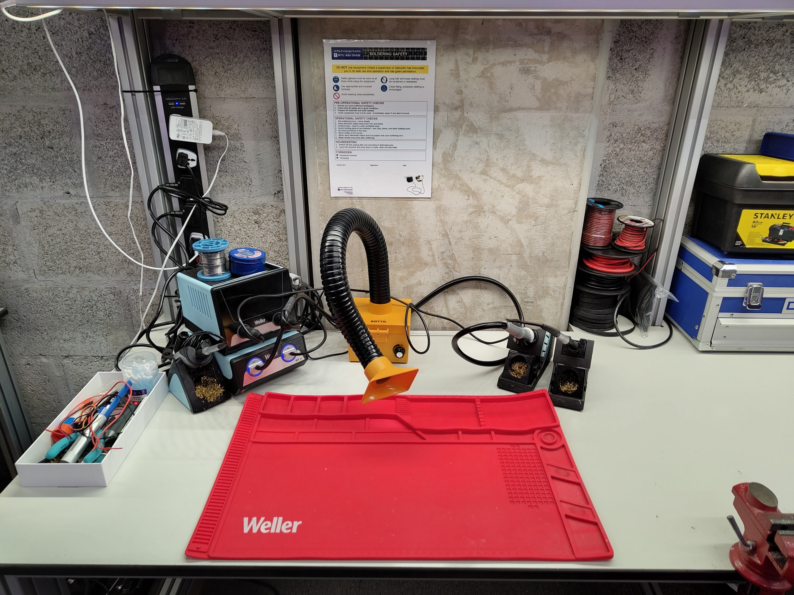
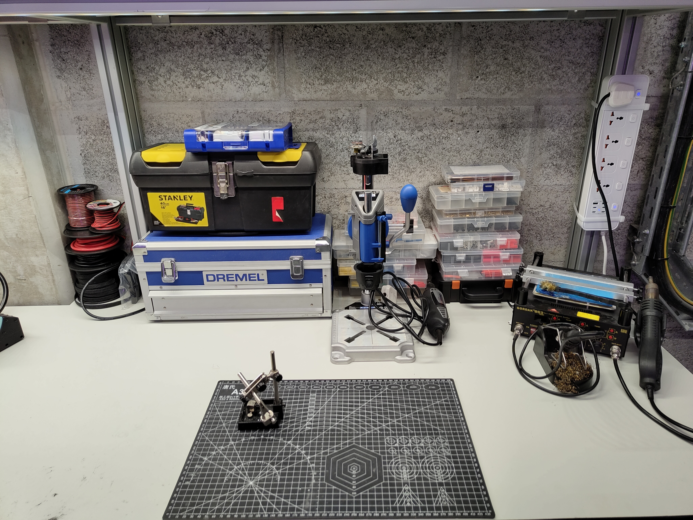

=========
Workspace
=========

The Workspace is a flexible environment for development and experimentation.

   KINESIS CTP Workspace overview

Features
--------

- Workstations for coding and data processing
- High-speed local network (KINESIS CTP Network)
- Adjustable Philips Hue smart lighting (app and switch controlled)
- Nearby benches with tools and test equipment
- High-performance AI workstation with 2× NVIDIA RTX 6000 Ada Generation GPUs
  (48 GB each); see :doc:`AI Workstation - Lambda </4-computing/workstations/ai-workstation>`
- Safe charging station for LiPo batteries

Development Activities
----------------------

The workspace supports:

- Software development and testing
- Data analysis and processing
- Equipment preparation and testing
- Team collaboration and meetings
- Prototyping and assembly

Available Resources
-------------------

- Multiple workbenches
- Test and measurement equipment
- Charging stations
- Tool storage
- Collaborative work areas

Lighting System
---------------

   Philips Hue App Dashboard — KINESIS CTP lighting zones

The KINESIS CTP lab uses **Philips Hue** smart lighting throughout, with LED strips installed in the ceiling and around the facility. Lights can be controlled via the **Philips Hue app** or through the **physical wall switches** installed at several points around the lab.

There are three independently controlled zones:

.. list-table::
   :widths: 20 80
   :header-rows: 1

   * - Zone
     - Description
   * - **Workshop**
     - LED strips covering the main workspace/workshop area. Adjustable color and intensity.
   * - **Arena**
     - LED strips covering the experimental arena. Adjustable color and intensity — useful for setting up lighting conditions for experiments.
   * - **Vicon Cameras**
     - This is not a lighting zone in the traditional sense. The 24 Vicon cameras are powered via two PoE switches, each connected to a **smart plug**. Switching off this zone cuts power to the PoE switches and therefore to all Vicon cameras.

Vicon Camera Power Management
~~~~~~~~~~~~~~~~~~~~~~~~~~~~~

The two PoE switches that power the 24 Vicon Vantage V16 cameras are connected to **smart plugs**, which are integrated into the Philips Hue ecosystem. This means camera power can be managed from:

- The **switch installed at the Vicon Command Center**
- The **Philips Hue app** (remotely)

.. important::

   **Turn off the Vicon cameras when not in use.** The cameras generate heat during operation and have a finite operational lifespan. After finishing a session with the Vicon system, switch off the Vicon camera zone (via the command center switch or the app) to cut power to both PoE switches. Re-enable it before the next session to allow cameras to initialise before launching Vicon Tracker or Nexus.

   To power off via the app: open Philips Hue → select the *KINESIS CTP* home → tap the **Vicon Cameras** zone toggle off.

Safety Equipment
----------------

.. _lipo-battery-charging-station:

LiPo Battery Charging Station
~~~~~~~~~~~~~~~~~~~~~~~~~~~~~

   LiPo Battery Charging Station

Dedicated safe charging station for lithium polymer batteries with:

- Fire-resistant charging cabinet
- Individual charging bays
- Battery health monitoring
- Emergency containment
- Proper ventilation

**Safety Protocol:** All LiPo and Li-ion batteries must be charged at this designated station using an approved charger and under supervision. Never charge batteries at workbenches or unattended, and do not use the charging station for storage.

.. _fireproof-battery-storage-cabinet:

Fireproof Battery Storage Cabinet
~~~~~~~~~~~~~~~~~~~~~~~~~~~~~~~~~

   Fireproof Battery Storage Cabinet

A yellow fire-resistant cabinet is available for large high-energy packs without a BMS, smart UAV packs, and OEM batteries whose manufacturer permits cabinet storage:

- Fireproof and fire-resistant construction
- Used for battery categories assigned to cabinet storage by the current SOP
- Reduces fire risk in the workspace
- Clearly labelled

**Storage Protocol:** Small conventional packs belong in their assigned BAT-SAFE/BatBox, while smart and OEM packs follow the manufacturer's approved storage method. Never place a damaged or suspect battery in normal storage.

Equipment Storage Cabinets
--------------------------

.. list-table::
   :widths: 50 50
   :header-rows: 0

   * - .. image:: ../_static/images/facility-equipment-cabinet-outside.jpg
          :alt: Equipment Storage Cabinets — Outside View
          :width: 100%
     - .. image:: ../_static/images/facility-equipment-cabinet-inside.jpg
          :alt: Equipment Storage Cabinets — Inside View Showing Labelled Drawers
          :width: 100%
   * - *Outside view of the storage cabinets*
     - *Inside view showing labelled individual drawers*

|

The lab has dedicated storage cabinets for equipment accessories, cables, and ancillary components. Each cabinet is organized with individual labelled drawers, most of which are exclusively dedicated to a specific piece of equipment — making it easy to find and return accessories without confusion.

- Each major equipment item (robot, sensor, drone) has one or more dedicated drawers
- Drawers are clearly labelled with the equipment name and asset tag where applicable
- Contents include batteries, chargers, cables, adapters, mounting hardware, and manuals
- Cabinets are kept locked outside of lab hours

Workshop Tools
--------------

Soldering Station
~~~~~~~~~~~~~~~~~

   Soldering Station

Professional soldering workspace equipped with:

- Temperature-controlled soldering irons
- Fume extraction system
- ESD-safe work surface
- Component storage
- Magnification tools
- Hand tools and supplies

Dremel & Precision Tools Station
~~~~~~~~~~~~~~~~~~~~~~~~~~~~~~~~

   Dremel and Precision Tools Station

Precision machining and fabrication station featuring:

- Rotary tools (Dremel)
- Cutting and grinding accessories
- Polishing and sanding tools
- Safety equipment (goggles, dust masks)
- Work clamps and vises
- Material samples and test pieces
