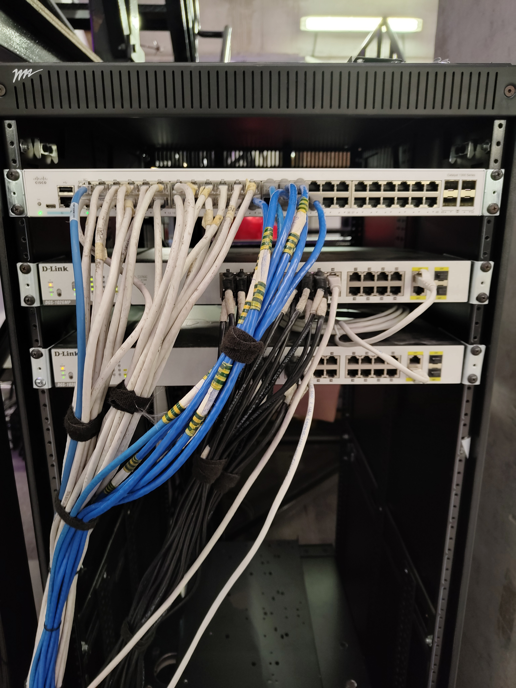
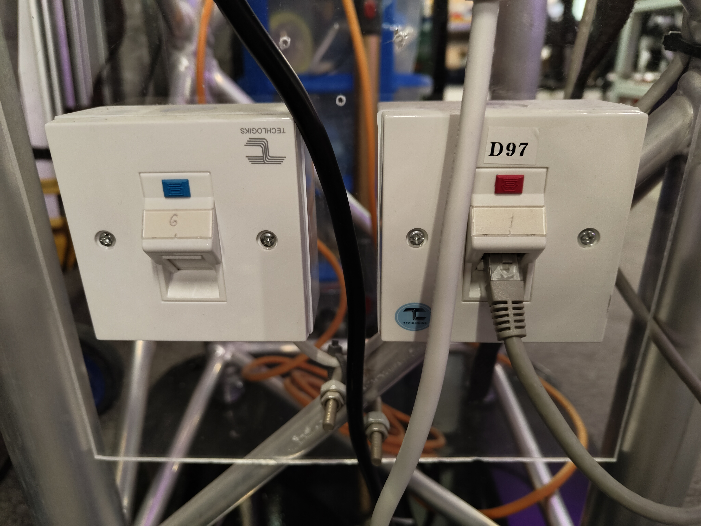

===================
KINESIS CTP Network
===================

The KINESIS CTP Network is the main laboratory network providing wired and wireless connectivity for workstations, equipment, and user devices.

Network Infrastructure Rack
---------------------------

   KINESIS CTP Network Rack

The network rack houses the core switching infrastructure for the KINESIS CTP Lab.

Main Cisco Switch
~~~~~~~~~~~~~~~~~

Provides wired ethernet to all **blue ports** throughout the lab. Not a PoE switch — all connected devices are powered independently.

Vicon PoE Switches
~~~~~~~~~~~~~~~~~~

Two dedicated PoE+ switches are used exclusively for the Vicon motion capture cameras:

- **PoE Switch 1** — Connects and powers Vicon cameras 1–12
- **PoE Switch 2** — Connects and powers Vicon cameras 13–24

The switches are interconnected and currently feed the Vicon host through one camera-side
Ethernet link. They remain isolated from the main KINESIS CTP network to preserve bandwidth and
stable power (IEEE 802.3at, 57 V DC). The physical inventory remains 24 cameras; the current
Vicon configuration expects 23.

Routers
-------

.. list-table::
   :widths: 50 50
   :header-rows: 0

   * - .. image:: ../../_static/images/network-kinesis-router.jpg
          :alt: KINESIS CTP Router
          :width: 100%
     - .. image:: ../../_static/images/network-hermes-router.jpg
          :alt: Hermes Network Router
          :width: 100%
   * - **KINESIS CTP Router**
     - **Hermes Router**

KINESIS CTP Router
~~~~~~~~~~~~~~~~~~

The **Linksys WRT 3200 ACM** is the main router providing lab-wide internet access and local network connectivity. All blue-port wired connections and the KINESIS WiFi route through this device.

Hermes Router
~~~~~~~~~~~~~

Dedicated router for arena operations. The Vicon PC connects to Hermes via wired Ethernet and uses it to broadcast real-time position data. Researcher laptops and robots connect wirelessly.

Wired Network Ports
-------------------

   Wired network ports in KINESIS CTP Lab

Two types of wired ethernet ports are available throughout the lab, clearly identified by color:

- **Blue ports** — KINESIS CTP local network (via the main Cisco switch). Use these to connect workstations, robots, and devices to the KINESIS CTP internal network and internet.
- **Red ports** — NYUAD main campus network. Use these to access the broader NYUAD institutional network directly.

Choose the appropriate port depending on whether you need access to the KINESIS CTP local resources (blue) or the NYUAD campus network (red).

Common Issues
-------------

*Troubleshooting guide to be added*
