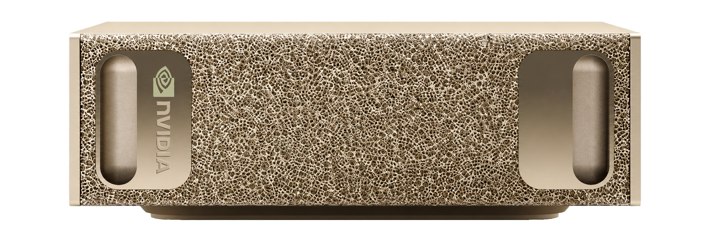

.. GENERATED FROM THE KINESIS VAULT — DO NOT EDIT THIS PAGE DIRECTLY.
.. equipment_id: 92416cbe-d475-4bc4-be54-8830c8d22f63

===================================
AI Workstation - DGX Spark - NVIDIA
===================================

.. container:: equipment-kicker

   NVIDIA · DGX Spark

   AI Workstation - DGX Spark - NVIDIA

.. list-table:: At a glance
   :class: equipment-facts-table
   :widths: 32 68
   :header-rows: 0

   * - **Manufacturer**
     - NVIDIA
   * - **Model**
     - DGX Spark
   * - **Equipment class**
     - AI Workstation
   * - **Location**
     - C3.B2.029.E (KINESIS CTP)
   * - **Quantity**
     - 1
   * - **Status**
     - Active
   * - **Training**
     - Required
   * - **Risk assessment**
     - Not currently listed as required
   * - **Primary contact**
     - Samuel A. Prieto (sxp8070)

Overview
--------

The NVIDIA DGX Spark is a purpose-built AI workstation powered by NVIDIA Grace Blackwell technology, designed for advanced AI development, model training, and inference workloads with exceptional performance and energy efficiency.

Specifications
--------------

.. list-table::
   :class: equipment-spec-table
   :widths: 38 62
   :header-rows: 0

   * - **Operating system**
     - NVIDIA DGX OS
   * - **Processor**
     - 20-core Arm CPU: 10 Cortex-X925 and 10 Cortex-A725 cores
   * - **Graphics / accelerator**
     - NVIDIA Blackwell GPU integrated in the GB10 Grace Blackwell Superchip
   * - **System memory**
     - 128 GB
   * - **Storage**
     - 4TB NVMe SSD
   * - **Networking**
     - 10 GbE; ConnectX-7 NIC up to 200 Gbps; Wi-Fi 7; Bluetooth 5.4
   * - **Additional specifications**
     - 128 GB LPDDR5x coherent unified memory; up to 1 PFLOP FP4; 240 W power supply; 140 W GB10 TDP; 150 x 150 x 50.5 mm; 1.2 kg

Typical workflows
-----------------

1. Train and fine-tune large language models and multimodal AI models
2. Run inference workloads for production AI applications
3. Develop and test AI agents and autonomous systems
4. Process large-scale datasets for computer vision and NLP
5. Prototype and benchmark AI algorithms before deploying to larger clusters

Software & dependencies
-----------------------

- NVIDIA AI Enterprise software suite
- CUDA Toolkit
- cuDNN
- TensorRT
- PyTorch
- TensorFlow
- JAX
- NVIDIA NeMo Framework

Access, training & booking
--------------------------

Access restricted to authorized personnel. Schedule intensive workloads to minimize conflicts with other users.

- **Training:** Hands-on training is required before operation.

Safety & operating limits
-------------------------

.. warning::

   - Schedule compute-intensive jobs during off-peak hours when possible.
   - Monitor GPU memory usage and close completed jobs promptly.
   - Maintain proper ventilation around the system.
   - Do not interrupt running training jobs without coordinating with other users.
   - Follow lab data-management policies when storing models and datasets.

**Operational controls**

- Training required

- **Software licence:** Required.

Keywords
--------

``AI`` · ``workstation`` · ``GPU`` · ``DGX`` · ``NVIDIA`` · ``Grace Blackwell`` · ``deep learning`` · ``machine learning`` · ``inference`` · ``training`` · ``compute``

.. include:: /_includes/contact-lab-manager.inc
