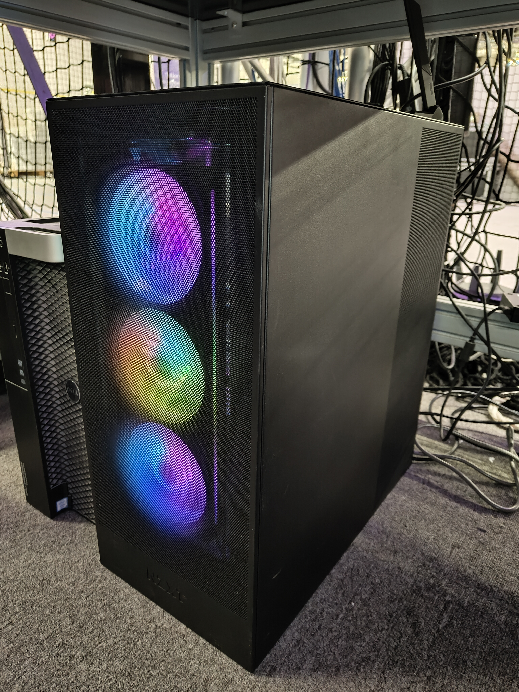

.. GENERATED FROM THE KINESIS VAULT — DO NOT EDIT THIS PAGE DIRECTLY.
.. equipment_id: a590da10-7154-4137-951d-1eab90b3c086

================================
Linux Workstation - Custom Build
================================

.. container:: equipment-kicker

   Golden Cloud Computer · Custom Build

   Linux Workstation - Custom Build

.. list-table:: At a glance
   :class: equipment-facts-table
   :widths: 32 68
   :header-rows: 0

   * - **Manufacturer**
     - Golden Cloud Computer
   * - **Model**
     - Custom Build
   * - **Equipment class**
     - PC
   * - **Location**
     - C3.B2.029.E (KINESIS CTP)
   * - **Quantity**
     - 1
   * - **Status**
     - Active
   * - **Training**
     - Not recorded
   * - **Risk assessment**
     - Not currently listed as required
   * - **Primary contact**
     - Samuel A. Prieto (sxp8070)

Overview
--------

Dedicated Linux workstation for KINESIS laboratory computing with an AMD Ryzen 9 7950X3D CPU and ASUS RTX 4090 STRIX 24 GB GPU.

Specifications
--------------

.. list-table::
   :class: equipment-spec-table
   :widths: 38 62
   :header-rows: 0

   * - **Processor**
     - AMD Ryzen 9 7950X3D 16-core
   * - **Graphics / accelerator**
     - ASUS RTX 4090 STRIX 24G
   * - **System memory**
     - 96 GB
   * - **Storage**
     - 2TB Samsung 990 Pro M.2 NVMe SSD
   * - **Additional specifications**
     - NZXT H7 Flow Case, NZXT Kraken Elite 360mm CPU Cooler, NZXT C1200 80+ Gold PSU, ASUS X670 Crosshair Hero Motherboard

Keywords
--------

``workstation`` · ``PC`` · ``compute`` · ``Linux`` · ``GPU compute``

.. note::

   For current availability or details not recorded here, contact
   Samuel A. Prieto (sxp8070).
