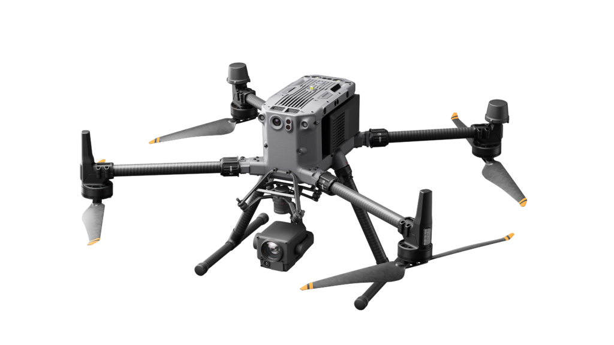

.. GENERATED FROM THE KINESIS VAULT — DO NOT EDIT THIS PAGE DIRECTLY.
.. equipment_id: 0bf75c2e-8349-41bc-af3c-dd3e1bbfcf6c

=============================
Drone - Matrice 300 RTK - DJI
=============================

.. container:: equipment-kicker

   DJI · Matrice 300 RTK

   Drone - Matrice 300 RTK - DJI

.. list-table:: At a glance
   :class: equipment-facts-table
   :widths: 32 68
   :header-rows: 0

   * - **Manufacturer**
     - DJI
   * - **Model**
     - Matrice 300 RTK
   * - **Equipment class**
     - UAV
   * - **Location**
     - C3.B2.029.E (KINESIS CTP)
   * - **Quantity**
     - 1
   * - **Status**
     - Active

.. container:: equipment-booking-card

   **Check availability before planning**

   Review availability and reserve the equipment through the CTP Scheduling System.
   Access the system from the NYUAD network or through the VPN.

   .. container:: equipment-booking-actions

      `Book this equipment <https://corelabs.abudhabi.nyu.edu>`_

Overview
--------

The DJI Matrice 300 RTK is an industrial quadcopter drone platform designed for professional aerial operations such as mapping, inspection, surveillance, and data collection. It supports RTK positioning for higher-accuracy navigation, multiple payload configurations (including multi-gimbal setups), and real-time video downlink for mission monitoring.

Specifications
--------------

.. list-table::
   :class: equipment-spec-table
   :widths: 38 62
   :header-rows: 0

   * - **Mobility**
     - Aerial
   * - **Unfolded dimensions**
     - 810 x 670 x 430 (L x W x H) mm
   * - **Folded dimensions**
     - 430 x 420 x 430 (L x W x H) mm
   * - **Weight without batteries**
     - 3.6 kg
   * - **Weight**
     - 6.3 kg
   * - **Payload**
     - 2.7 kg
   * - **Maximum takeoff weight**
     - 9 kg
   * - **Maximum speed**
     - 23 m/s
   * - **Maximum wind resistance**
     - 12 m/s
   * - **Maximum flight time**
     - 55 min
   * - **Service ceiling**
     - 5,000 m
   * - **Additional specifications**
     - The 6.3 kg operating weight includes two TB60 batteries. A 7000 m service ceiling requires high-altitude propellers and takeoff mass no greater than 7 kg.
   * - **Ingress protection**
     - IP45
   * - **Operating temperature**
     - -20 to 50 °C
   * - **Operating environment**
     - Indoor and outdoor
   * - **Sensing modalities**
     - RGB, GPS

Typical workflows
-----------------

1. Pre-flight checklist including propeller integrity, GPS lock, battery level, and firmware status
2. Configure payloads (single/dual downward gimbals and/or upward gimbal) for imaging or inspection tasks
3. RTK-enabled flight for higher-accuracy positioning and mission execution
4. Mission flight with real-time video downlink for mapping, inspection, or surveillance
5. Post-flight data export and firmware updates using DJI Pilot 2 or DJI Assistant 2 (Enterprise Series)

.. note::

   These examples are an overview. Follow the current equipment manual and SOP,
   where available, together with the applicable risk assessment and training,
   for the complete procedure.

Software & dependencies
-----------------------

- DJI Pilot 2
- DJI Assistant 2 (Enterprise Series)

Safety & operating limits
-------------------------

.. warning::

   - Primary hazards include high-speed propellers, lithium-battery fire, aircraft impact or falling from height, electromagnetic interference, and adverse weather.
   - Do not fly over people, moving vehicles, or sensitive infrastructure.
   - Outdoor operations require a GCAA drone pilot licence, and geofencing must prevent entry into forbidden areas.
   - Use the controller Combination Stick Command (CSC) for emergency propeller shutdown.
   - Follow the approved battery-charging procedure; never leave batteries unattended while charging or charge them near flammable materials.
   - For long-term storage, power off the aircraft, disconnect the batteries, use a fireproof or LiPo-safe container inside the padded hard case, and charge or discharge the batteries every three months.

**Access and operational conditions**

- Only trained and authorised personnel may operate the drone. All operations must maintain visual line of sight (VLOS). Outdoor flights require a GCAA-issued drone pilot licence and prior EHS approval — no outdoor flight may proceed without EHS permit and no-fly zone verification.

**Approved operating area**

- KINESIS CTP Arena and flight locations explicitly approved through the applicable NYUAD EHS and aviation-authority processes.

**Environmental limits**

- Keep the equipment dry; do not operate it in rain, spray, or wet conditions.
- Do not fly in rain, heavy fog, or wind above the manufacturer and mission-approval limits.
- Keep batteries and aircraft away from moisture, dust, direct sunlight, and temperature extremes during storage.

**Required attire and conditional PPE**

- Long pants.
- Closed-toed shoes.
- Safety goggles.

**Operational controls**

- Permit required

Related equipment & documentation
---------------------------------

- **Compatible equipment:** :doc:`LiDAR Mapping Payload - Hovermap ST - Emesent </3-equipment/sensors/lidar-mapping-payload-hovermap-st-emesent>`
- **Compatible equipment:** :doc:`Thermal/Visual Camera - WIRIS Pro SC - Workswell </3-equipment/sensors/thermalvisual-camera-wiris-prosc-workswell>`

Keywords
--------

``drone`` · ``UAV`` · ``aerial mapping`` · ``RTK`` · ``survey`` · ``photogrammetry`` · ``outdoor`` · ``professional`` · ``inspection`` · ``indoor``

.. include:: /_includes/contact-lab-manager.inc
