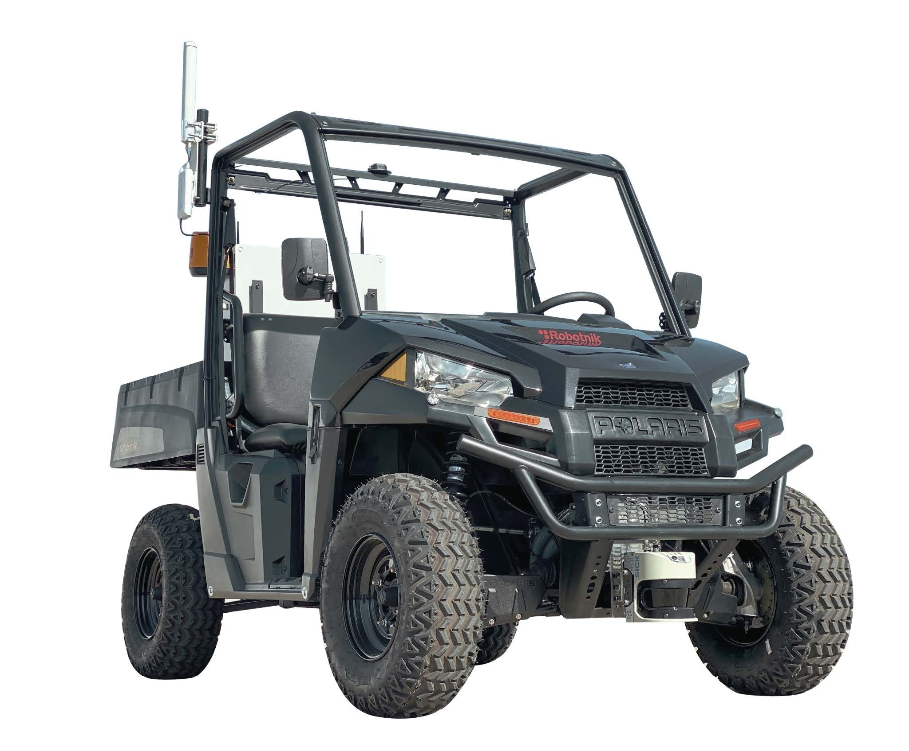

.. GENERATED FROM THE KINESIS VAULT — DO NOT EDIT THIS PAGE DIRECTLY.
.. equipment_id: 863085cf-39f1-490e-90f5-e2a55823835e

====================================
Autonomous Buggy - RB-CAR - Robotnik
====================================

.. container:: equipment-kicker

   Robotnik · RB-CAR

   Autonomous Buggy - RB-CAR - Robotnik

.. list-table:: At a glance
   :class: equipment-facts-table
   :widths: 32 68
   :header-rows: 0

   * - **Manufacturer**
     - Robotnik
   * - **Model**
     - RB-CAR
   * - **Equipment class**
     - Ground Robot
   * - **Location**
     - C3.B2.029.E (KINESIS CTP)
   * - **Quantity**
     - 1
   * - **Status**
     - Active

.. container:: equipment-booking-card

   **Check availability before planning**

   Review availability and reserve the equipment through the CTP Scheduling System.
   Access the system from the NYUAD network or through the VPN.

   .. container:: equipment-booking-actions

      `Book this equipment <https://corelabs.abudhabi.nyu.edu>`_

Overview
--------

The Robotnik RB-CAR is a 4x4 electric research buggy (based on a Polaris RANGER EV chassis) with servo-actuated steering and traction controlled by an onboard computer for manual driving, teleoperation, or autonomous operation. It is used for autonomous navigation R&D, perception testing, and data collection on approved outdoor campus test roads.

Specifications
--------------

.. list-table::
   :class: equipment-spec-table
   :widths: 38 62
   :header-rows: 0

   * - **Mobility**
     - Wheeled
   * - **Dimensions**
     - 2727 x 1444 x 2082 (L x W x H) mm
   * - **Weight**
     - 800 kg
   * - **Passenger capacity**
     - 2
   * - **Payload**
     - 227 kg
   * - **Manufacturer maximum speed**
     - 9.72 m/s
   * - **Operational speed limit**
     - 5.56 m/s
   * - **Maximum range**
     - 70 km
   * - **Maximum slope**
     - 30 %
   * - **Towing capacity**
     - 680 kg
   * - **Battery charge capacity**
     - 240 Ah
   * - **Battery voltage**
     - 48 V
   * - **Ingress protection**
     - IP54
   * - **Operating environment**
     - Outdoor

Typical workflows
-----------------

1. Pre-drive checks and safety system reset (local/remote E-stop and handbrake interlock)
2. Manual driving with steering wheel and pedals
3. Teleoperation using gamepad (with remote E-stop as safety device)
4. Autonomous navigation research and perception testing in controlled areas
5. Data collection using onboard sensors (e.g., lidar, GPS) via ROS
6. Battery charging in a ventilated area after use

.. note::

   These examples are an overview. Follow the current equipment manual and SOP,
   where available, together with the applicable risk assessment and training,
   for the complete procedure.

Software & dependencies
-----------------------

- ROS
- Ubuntu 20.04

Development repositories
------------------------

- `KinesisCTP/rb-car <https://github.com/KinesisCTP/rb-car>`_ — Kinesis CTP onboarding workspace for Robotnik RB-CAR development with ROS 1 Noetic.

Safety & operating limits
-------------------------

.. warning::

   - Operate only on the approved Service Road behind campus and Ring Road Amber Zones.
   - Operate only from Monday to Thursday.
   - Do not operate during peak traffic hours (07:00–09:00 and 15:00–17:00).
   - Notify the DCS Command Centre before each experiment.
   - A minimum of two researchers must be present, including one designated driver with a valid UAE licence and one perimeter watcher.
   - Deploy warning signs and activate the installed warning strobe during operation.
   - Do not exceed the 20 km/h operational speed limit.
   - Keep a clear perimeter and do not allow anyone near the vehicle while the motor drives are enabled.
   - Keep an operator seated whenever the vehicle is powered and safety has been restarted, and use the seat belts.
   - Do not rely on the laser stop at higher speeds; it is configured for low-speed autonomous operation.
   - Set the keyswitch to OFF and isolate main power before qualified personnel access the rear control cabinet.
   - The battery system is high-current 48 V DC lead-acid; use only the provided charger and never cover the battery or charger while charging.
   - Motor, controller, and brake components can exceed 80 °C; enforce a cool-down period before authorised maintenance inside the rear electronics bay.

**Approved operating area**

- Service Road behind campus (Amber Zone).
- Ring Road (Amber Zone).

Operations outside the approved area require a submitted and approved
`Robotics Review Committee (RRC) Mission Review Form <https://docs.google.com/forms/d/e/1FAIpQLSdj0OyfnCpAIcmQqXW_oNY_B6kJzBgunmGXpXxznvEGFAQ2Ew/viewform>`_ before the experiment begins.

**Environmental limits**

- Keep the equipment dry; do not operate it in rain, spray, or wet conditions.
- Charge only in a well-ventilated area with the hood or doors open.
- Do not operate in fog, sandstorms, or other low-visibility conditions.

**Required attire and conditional PPE**

- Long pants.
- Closed-toed shoes.
- Protective gloves are required only for authorised maintenance inside the isolated rear electronics bay after hot components have cooled sufficiently for the task.

**Operational controls**

- Two-person operation

Keywords
--------

``autonomous vehicle`` · ``ground robot`` · ``self-driving`` · ``car`` · ``outdoor`` · ``ROS`` · ``wheeled`` · ``research platform``

.. include:: /_includes/contact-lab-manager.inc
