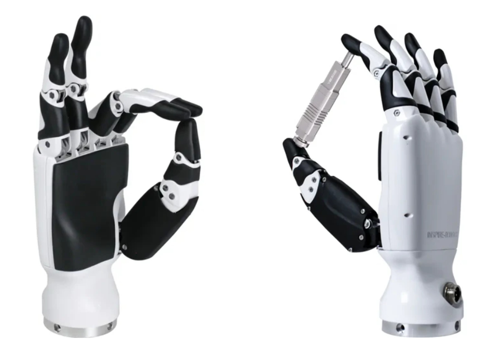

.. GENERATED FROM THE KINESIS VAULT — DO NOT EDIT THIS PAGE DIRECTLY.
.. equipment_id: dd10d60e-9f70-491c-9584-c496376f21a1

======================================
Dexterous Hand - RH56 - Inspire Robots
======================================

.. container:: equipment-kicker

   Inspire Robots · RH56

   Dexterous Hand - RH56 - Inspire Robots

.. list-table:: At a glance
   :class: equipment-facts-table
   :widths: 32 68
   :header-rows: 0

   * - **Manufacturer**
     - Inspire Robots
   * - **Model**
     - RH56
   * - **Equipment class**
     - Robot manipulation
   * - **Location**
     - C3.B2.029.E (KINESIS CTP)
   * - **Quantity**
     - 2
   * - **Status**
     - Active

.. container:: equipment-booking-card

   **Check availability before planning**

   Review availability and reserve the equipment through the CTP Scheduling System.
   Access the system from the NYUAD network or through the VPN.

   .. container:: equipment-booking-actions

      `Book this equipment <https://corelabs.abudhabi.nyu.edu>`_

Overview
--------

The Inspire Robots RH56 is a dexterous robotic hand with six linear servo actuators and integrated force/pressure sensing, designed to grip and manipulate objects. It is typically used on a benchtop or mounted to a robot for research tasks such as installation, calibration, and controlled grasping under software supervision.

Specifications
--------------

.. list-table::
   :class: equipment-spec-table
   :widths: 38 62
   :header-rows: 0

   * - **Mobility**
     - Robot-mounted
   * - **Dimensions**
     - Approx. 217.8 x 80.7 x 49.3 (BFX/DFX variants) mm
   * - **Weight**
     - 0.54 kg
   * - **Joint count**
     - 12
   * - **Degrees of freedom**
     - 6
   * - **Force sensor count**
     - 6
   * - **Force sensor resolution**
     - 0.5 N
   * - **Fingertip repeatability**
     - 0.2 mm
   * - **Supply voltage**
     - 24 V
   * - **Interfaces**
     - RS-485
   * - **Operating environment**
     - Indoor
   * - **Compatible platforms**
     - Unitree H1, Unitree G1, Benchtop

Typical workflows
-----------------

1. Mechanical mounting to a bench setup or robot
2. Electrical connection to a 24 V DC SELV supply
3. Force sensor calibration under no-load conditions
4. Software-controlled grasping and object manipulation with configured force thresholds

.. note::

   These examples are an overview. Follow the current equipment manual and SOP,
   where available, together with the applicable risk assessment and training,
   for the complete procedure.

Safety & operating limits
-------------------------

.. warning::

   - Use the host system's emergency stop to halt motion; the hand has no specified dedicated emergency shutdown.
   - Disconnect the 24 V DC supply only when it is safe to approach.
   - Inspect the GX12 cable and connector before each use and do not operate with damaged insulation.
   - Securely mount the hand before energising it and keep hands clear during actuation.
   - Use reduced speed during setup and teaching, and configure force thresholds to stop on unintended contact.
   - Announce motions and keep loose clothing and jewellery away from finger travel paths.
   - Store the hand powered off and protected from dust and mechanical loads on the fingers or palm.

**Access and operational conditions**

- Operation requires training and authorisation. Intended for bench-top and robot-mounted use.

**Approved operating area**

- Inside the KINESIS CTP Lab.

Operations outside the approved area require a submitted and approved
`Robotics Review Committee (RRC) Mission Review Form <https://docs.google.com/forms/d/e/1FAIpQLSdj0OyfnCpAIcmQqXW_oNY_B6kJzBgunmGXpXxznvEGFAQ2Ew/viewform>`_ before the experiment begins.

**Environmental limits**

- Operate indoors only.
- Keep the equipment dry; do not operate it in rain, spray, or wet conditions.

**Required attire and conditional PPE**

- Long pants.
- Closed-toed shoes.
- Safety goggles.

Related equipment & documentation
---------------------------------

- **Compatible equipment:** :doc:`Humanoid Robot - G1 EDU U4 - Unitree </3-equipment/ground/humanoid-robot-g1-unitree>`
- **Compatible equipment:** :doc:`Humanoid Robot - H1-2 - Unitree </3-equipment/ground/humanoid-robot-h1-unitree>`

Keywords
--------

``dexterous hand`` · ``robotic hand`` · ``manipulation`` · ``humanoid`` · ``left hand`` · ``grasping`` · ``Inspire Robots``

.. include:: /_includes/contact-lab-manager.inc
