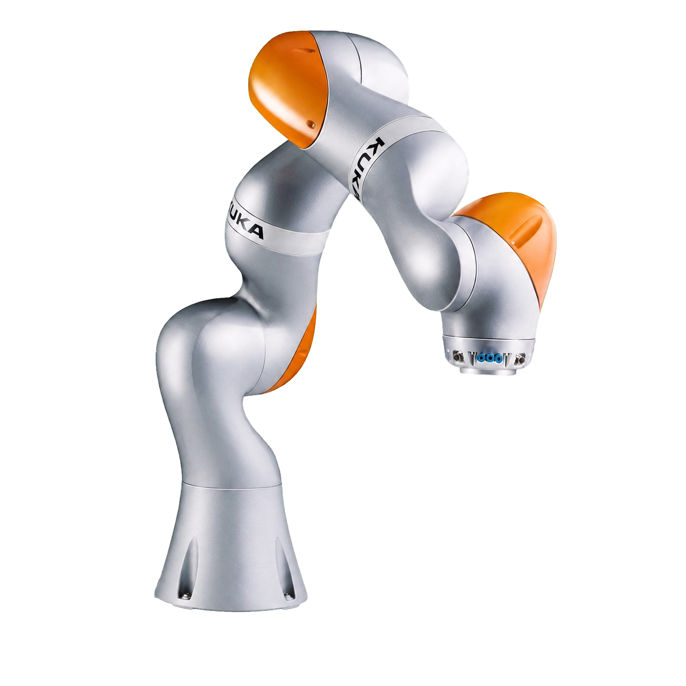

.. GENERATED FROM THE KINESIS VAULT — DO NOT EDIT THIS PAGE DIRECTLY.
.. equipment_id: be82881d-4fe7-49a0-a82f-c4a4fc6b74bf

=====================================
Robotic Arm - LBR iiwa 14 R820 - KUKA
=====================================

.. container:: equipment-kicker

   KUKA · LBR iiwa 14 R820

   Robotic Arm - LBR iiwa 14 R820 - KUKA

.. list-table:: At a glance
   :class: equipment-facts-table
   :widths: 32 68
   :header-rows: 0

   * - **Manufacturer**
     - KUKA
   * - **Model**
     - LBR iiwa 14 R820
   * - **Equipment class**
     - Robot manipulation
   * - **Location**
     - C3.B2.029.E (KINESIS CTP)
   * - **Quantity**
     - 1
   * - **Status**
     - Active
   * - **Training**
     - Required
   * - **Risk assessment**
     - Required
   * - **Primary contact**
     - Samuel A. Prieto (sxp8070)

Overview
--------

The KUKA LBR iiwa 14 R820 is a 7-axis collaborative robotic arm used for research tasks such as assembly, inspection, and human-robot collaboration. It is operated via the KUKA Sunrise Cabinet controller and smartPAD teach pendant, with Java-based applications developed and managed in KUKA Sunrise.OS / Sunrise.Workbench.

Specifications
--------------

.. list-table::
   :class: equipment-spec-table
   :widths: 38 62
   :header-rows: 0

   * - **Mobility**
     - Fixed
   * - **Reach**
     - 820 mm
   * - **Degrees of freedom**
     - 7
   * - **Payload**
     - 14 kg
   * - **Pose repeatability**
     - 0.15 mm
   * - **Weight**
     - 29.9 kg
   * - **Controller**
     - KUKA Sunrise Cabinet
   * - **Ingress protection**
     - IP54
   * - **Operating temperature**
     - 5 to 45 °C
   * - **Operating environment**
     - Indoor

Typical workflows
-----------------

1. jogging and teaching motions using the smartPAD
2. running Java-based robot applications via Sunrise.Workbench and the smartPAD
3. assembly, inspection, research, and human-robot collaboration tasks

Software & dependencies
-----------------------

- KUKA Sunrise.OS
- KUKA Sunrise.Workbench
- WorkVisual 4.0
- Windows 7

Access, training & booking
--------------------------

Only trained and authorised personnel may programme or run the robot.

- **Training:** Hands-on training is required before operation.
- **Risk assessment:** A task-appropriate risk assessment is required before use.

Safety & operating limits
-------------------------

.. warning::

   - Maintain at least 2 m clearance around the arm during automatic motion.
   - Verify the Emergency-Stop and enabling switches before every shift.
   - Run new or edited programs first in Manual Reduced Velocity (T1).
   - Never enter the workspace unless the robot is in T1 or powered down with the brakes applied.
   - For storage, power off the Sunrise Cabinet, wait for its fans and indicators to stop, unplug AC mains, and rest the robot in a seated or folded posture with axis brakes engaged.

**Approved operating area**

- The installed KUKA workcell inside the KINESIS CTP Lab.

Operations outside the approved area require a submitted and approved
`Robotics Review Committee (RRC) Mission Review Form <https://docs.google.com/forms/d/e/1FAIpQLSdj0OyfnCpAIcmQqXW_oNY_B6kJzBgunmGXpXxznvEGFAQ2Ew/viewform>`_ before the experiment begins.

**Environmental limits**

- Operate indoors only.
- Operate and store the system indoors within the temperature, humidity, ventilation, vibration, and dust limits specified in the KUKA manuals.

**Required attire and conditional PPE**

- Long pants.
- Closed-toed shoes.

**Operational controls**

- Risk assessment required
- Training required

Related equipment & documentation
---------------------------------

- **Compatible equipment:** :doc:`Robotic Gripper - 3-Finger Adaptive - Robotiq </3-equipment/ground/robotic-gripper-3-finger-adaptive-robotiq>`

Keywords
--------

``robotic arm`` · ``collaborative robot`` · ``cobot`` · ``manipulation`` · ``KUKA`` · ``iiwa`` · ``7-axis`` · ``indoor`` · ``human-safe``

.. include:: /_includes/contact-lab-manager.inc
