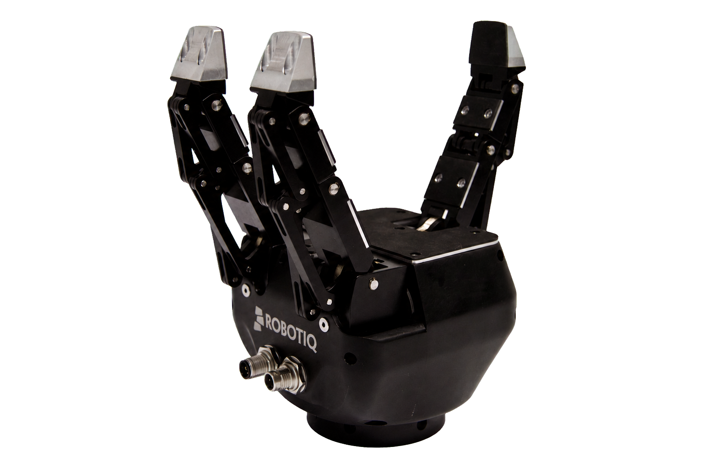

.. GENERATED FROM THE KINESIS VAULT — DO NOT EDIT THIS PAGE DIRECTLY.
.. equipment_id: e18fcb75-4bdc-4b54-a54e-8d573ecb68b3

=============================================
Robotic Gripper - 3-Finger Adaptive - Robotiq
=============================================

.. container:: equipment-kicker

   Robotiq · 3-Finger Adaptive

   Robotic Gripper - 3-Finger Adaptive - Robotiq

.. list-table:: At a glance
   :class: equipment-facts-table
   :widths: 32 68
   :header-rows: 0

   * - **Manufacturer**
     - Robotiq
   * - **Model**
     - 3-Finger Adaptive
   * - **Equipment class**
     - Robot manipulation
   * - **Location**
     - C3.B2.029.E (KINESIS CTP)
   * - **Quantity**
     - 1
   * - **Status**
     - Active
   * - **Training**
     - Required
   * - **Risk assessment**
     - Required
   * - **Primary contact**
     - Samuel A. Prieto (sxp8070)

.. note::

   This record describes a managed component or accessory. Check the related equipment and
   system documentation before planning standalone use.

Overview
--------

The Robotiq 3-Finger Adaptive Gripper is a robotic end-effector designed to be mounted on a robotic arm for grasping, manipulating, and releasing objects of varying shapes and sizes. It supports multiple grasp modes (basic, wide, pinch, scissor) and is typically used in supervised lab conditions for grasping experiments and manipulation research.

Specifications
--------------

.. list-table::
   :class: equipment-spec-table
   :widths: 38 62
   :header-rows: 0

   * - **Mobility**
     - Robot-mounted
   * - **Opening width**
     - 167 mm
   * - **Maximum encompassing diameter**
     - 155 mm
   * - **Weight**
     - 2.3 kg
   * - **Recommended handled payload**
     - 10 kg (encompassing grip); 2.5 kg (fingertip grip)
   * - **Maximum fingertip grip force**
     - 70 N
   * - **Maximum closing speed**
     - 110 mm/s
   * - **Supply voltage**
     - 24 V
   * - **Interfaces**
     - Modbus RTU, Modbus TCP
   * - **Operating environment**
     - Indoor

Typical workflows
-----------------

1. mounting the gripper on a robotic arm for grasping and manipulation experiments
2. selecting grasp mode (basic, wide, pinch, scissor) and tuning speed/force parameters
3. activating and controlling the gripper via robot integration or Robotiq User Interface
4. gripping, manipulating, and releasing test objects under supervised lab conditions

Software & dependencies
-----------------------

- Robotiq User Interface
- Modbus RTU
- Modbus TCP

Access, training & booking
--------------------------

Indoor operation on a level, non-slip floor. Requires a dedicated 24 V DC bench supply and Ethernet/fieldbus cabling routed along the robot harness.

- **Training:** Hands-on training is required before operation.
- **Risk assessment:** A task-appropriate risk assessment is required before use.

Safety & operating limits
-------------------------

.. warning::

   - Primary hazards include pinch or crush points, objects dropped or ejected during fast motion, entanglement, and damaged 24 V DC SELV wiring.
   - Keep hands and clothing clear while powered and verify the grasp mode, speed, and force in teach mode before automated runs.
   - Use a certified 24 V DC supply with a 4 A fuse, inspect and strain-relieve cables, and never connect the gripper to AC or modify its wiring.
   - For emergency shutdown, press the host robot's emergency stop or cut the 24 V DC supply.
   - For storage, power off the gripper, disconnect its cables, and protect it from dust, moisture, and temperature extremes.

**Approved operating area**

- KINESIS CTP Lab workbench or an approved KINESIS robot workcell.

Operations outside the approved area require a submitted and approved
`Robotics Review Committee (RRC) Mission Review Form <https://docs.google.com/forms/d/e/1FAIpQLSdj0OyfnCpAIcmQqXW_oNY_B6kJzBgunmGXpXxznvEGFAQ2Ew/viewform>`_ before the experiment begins.

**Environmental limits**

- Operate indoors only.

**Required attire and conditional PPE**

- Safety glasses or safety goggles.

**Operational controls**

- Supervisor required
- Risk assessment required
- Training required
- Plan, route, and supervise the tether or cable throughout operation.

Related equipment & documentation
---------------------------------

- **Compatible equipment:** :doc:`Robotic Arm - LBR iiwa 14 R820 - KUKA </3-equipment/ground/robotic-arm-lbr-iiwa-14-r820-kuka>`

Keywords
--------

``gripper`` · ``robotic gripper`` · ``manipulation`` · ``adaptive`` · ``3-finger`` · ``Robotiq`` · ``end effector``

.. include:: /_includes/contact-lab-manager.inc
