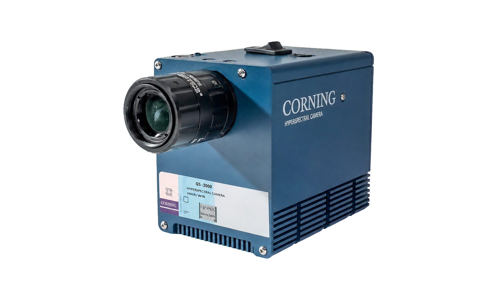

.. GENERATED FROM THE KINESIS VAULT — DO NOT EDIT THIS PAGE DIRECTLY.
.. equipment_id: 8a44b18c-dd10-454c-8899-8758ad436654

===================================================
Hyperspectral Camera - microHSI 410 SHARK - Corning
===================================================

.. container:: equipment-kicker

   Corning Specialty Materials · microHSI 410 SHARK

   Hyperspectral Camera - microHSI 410 SHARK - Corning

.. list-table:: At a glance
   :class: equipment-facts-table
   :widths: 32 68
   :header-rows: 0

   * - **Manufacturer**
     - Corning Specialty Materials
   * - **Model**
     - microHSI 410 SHARK
   * - **Equipment class**
     - Camera
   * - **Location**
     - C3.B2.029.E (KINESIS CTP)
   * - **Quantity**
     - 1
   * - **Status**
     - Active

Overview
--------

The Corning microHSI 410 SHARK is a compact push-broom VNIR hyperspectral imaging system for UAV and remote-sensing workflows. It captures spatially resolved spectral data from 400 to 1000 nm and includes onboard processing, storage, GPS, and inertial navigation.

Specifications
--------------

.. list-table::
   :class: equipment-spec-table
   :widths: 38 62
   :header-rows: 0

   * - **Sensing modalities**
     - Hyperspectral, VNIR, GPS, IMU
   * - **Sensor type**
     - Fully coherent push-broom line-imaging spectrograph with CMOS detector
   * - **Spectral range**
     - 400 to 1000 nm
   * - **Spatial pixels**
     - 1,364
   * - **Spectral bin size**
     - 2 nm
   * - **Spectral resolution**
     - Approximately 8 nm at 4x spectral binning
   * - **Profile rate**
     - Over 400 Hz (profile-dependent)
   * - **Bit depth**
     - 12 bit
   * - **Field of view**
     - 28.6 °
   * - **Power consumption**
     - less than 19 W
   * - **Supply voltage**
     - 12 V
   * - **Mobility**
     - Drone-mount
   * - **Weight**
     - 0.68 kg

Keywords
--------

``hyperspectral`` · ``camera`` · ``spectral analysis`` · ``remote sensing`` · ``multispectral`` · ``imaging``

.. include:: /_includes/contact-lab-manager.inc
