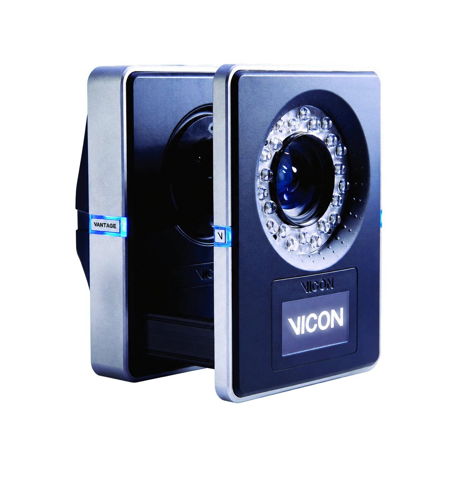

.. GENERATED FROM THE KINESIS VAULT — DO NOT EDIT THIS PAGE DIRECTLY.
.. equipment_id: c06c328c-d453-41ba-8a7d-a876f9dbd4e9

===========================================
Motion Capture System - Vantage V16 - Vicon
===========================================

.. container:: equipment-kicker

   Vicon · Vantage V16

   Motion Capture System - Vantage V16 - Vicon

.. list-table:: At a glance
   :class: equipment-facts-table
   :widths: 32 68
   :header-rows: 0

   * - **Manufacturer**
     - Vicon
   * - **Model**
     - Vantage V16
   * - **Equipment class**
     - Motion capture
   * - **Location**
     - C3.B2.029.E (KINESIS CTP)
   * - **Quantity**
     - 1
   * - **Status**
     - Active

.. container:: equipment-booking-card

   **Check availability before planning**

   Review availability and reserve the equipment through the CTP Scheduling System.
   Access the system from the NYUAD network or through the VPN.

   .. container:: equipment-booking-actions

      `Book this equipment <https://corelabs.abudhabi.nyu.edu>`_

Overview
--------

The Vicon Vantage V16 is an operational networked set of 23 infrared optical cameras (16 MP per camera) mounted around a capture volume to track retro-reflective markers and reconstruct 3D motion. Cameras connect via PoE+ Ethernet switches to a host PC running Vicon software (Nexus, Shōgun, or Tracker) for real-time capture, recording, and analysis of movement for applications such as gait analysis, animation, robotics, and engineering studies.

Specifications
--------------

.. list-table::
   :class: equipment-spec-table
   :widths: 38 62
   :header-rows: 0

   * - **Sensing modalities**
     - Mocap
   * - **Resolution**
     - 4096 x 4096 pixels
   * - **Camera resolution**
     - 16 MP
   * - **Frame rate**
     - 120 fps at full resolution; up to 500 fps at 4.2 MP with full field of view; up to 2,000 fps with partial scan
   * - **Camera count**
     - 23
   * - **Global shutter**
     - Yes
   * - **Illumination**
     - 850 nm infrared strobe
   * - **Mobility**
     - Fixed
   * - **Weight per camera**
     - 1.6 kg
   * - **Operating environment**
     - Indoor

Typical workflows
-----------------

1. Installing cameras on overhead rails or tripods and routing PoE+ cabling to switches
2. Calibrating the capture volume using the Vicon Active Wand
3. Live motion capture with IR strobe illumination and marker tracking
4. Recording and exporting motion data for gait analysis, animation, robotics, and engineering studies

.. note::

   These examples are an overview. Follow the current equipment manual and SOP,
   where available, together with the applicable risk assessment and training,
   for the complete procedure.

Software & dependencies
-----------------------

- Vicon Nexus
- Vicon Shogun
- Vicon Tracker
- VAULT

Safety & operating limits
-------------------------

.. warning::

   - Use certified IEEE 802.3at PoE+ switches, inspect the Vicon-supplied shielded Cat-5e leads, and keep ports de-energised until connection handshakes complete.
   - Use approved mounting hardware for the approximately 1.6 kg cameras, verify fastener torque, and strain-relieve all cables.
   - Avoid staring into the 850 nm infrared strobe emitters at close range and brief all visitors.
   - Cameras and strobes warm during prolonged operation; maintain ventilation and do not touch heat sinks while powered.
   - For emergency shutdown, stop capture in software and switch off the PoE+ switch; if it is unresponsive, unplug its mains cord and disconnect camera RJ-45 plugs only after the LEDs are dark.
   - For storage, switch off PoE+, secure the leads, fit lens caps, place cameras in padded cases, and do not stack heavy objects on camera bodies.

**Access and operational conditions**

- The Vicon manuals are the definitive authority and must be reviewed before each use.

**Environmental limits**

- Operate indoors only.
- Operate indoors with adequate ventilation and keep cameras, PoE equipment, and cabling dry and free of excessive dust.
- Store cameras in padded cases in a dry, dust-free cabinet at -10 °C to 50 °C.

- **Software licence:** Required.

Related equipment & documentation
---------------------------------

- **Related documentation:** :doc:`Related system documentation </2-facilities/arena>`

Keywords
--------

``motion capture`` · ``mocap`` · ``tracking`` · ``indoor`` · ``Vicon`` · ``biomechanics`` · ``animation`` · ``marker-based``

.. include:: /_includes/contact-lab-manager.inc
