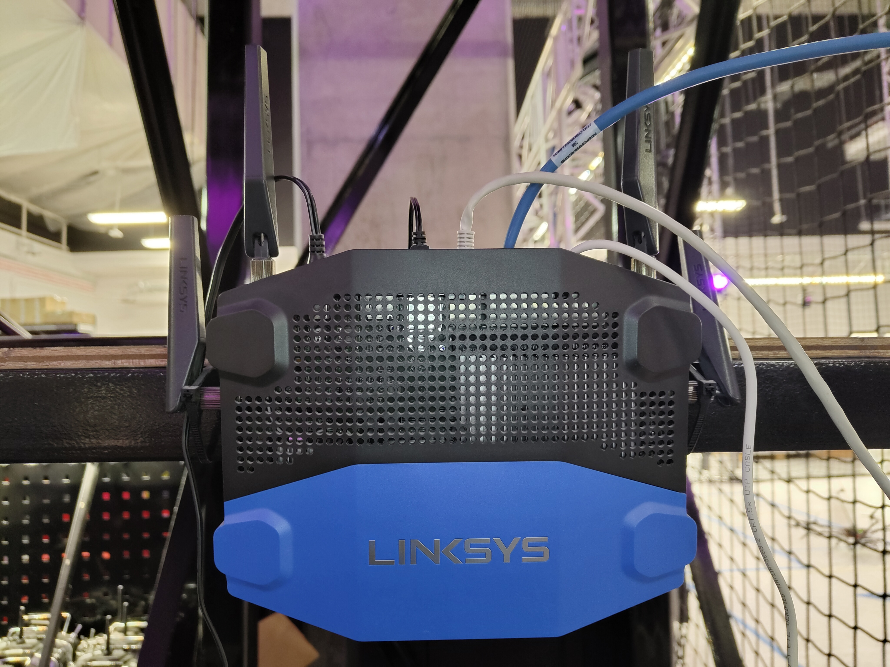

=======================
Networks & Connectivity
=======================

The KINESIS CTP Lab provides local laboratory connectivity through the KINESIS CTP Network and
institutional connectivity through the NYUAD campus network.

Choosing a Connection
---------------------

- **KINESIS CTP:** Use the blue ethernet ports or KINESIS Wi-Fi for general laboratory
  connectivity, robot control, file transfers, software updates, and KINESIS resources.
- **NYUAD:** Use the red ethernet ports or NYUAD wireless network for direct access to the
  institutional network and NYUAD services.
- **Hermes:** Use Hermes only for real-time Vicon position-data distribution to approved
  clients. See the :ref:`Hermes section <hermes-network>` under the Vicon System.

Wired Network Ports
-------------------

.. figure:: ../../_static/images/network-wired-ports.jpg
   :alt: Wired network ports in KINESIS CTP Lab
   :width: 55%
   :align: center

   Wired network ports in KINESIS CTP Lab

The wired ethernet ports are identified by colour:

- **Blue ports** — KINESIS CTP local network. Use these for lab workstations, robots, and
  equipment that require KINESIS resources or general internet connectivity.
- **Red ports** — NYUAD campus network. Use these for direct access to the institutional
  network.

KINESIS CTP Network
-------------------

Network Infrastructure Rack
^^^^^^^^^^^^^^^^^^^^^^^^^^^

.. figure:: ../../_static/images/network-kinesis-rack.jpg
   :alt: KINESIS CTP Network rack
   :width: 55%
   :align: center

   KINESIS CTP Network rack

The rack houses the main switching infrastructure for the KINESIS CTP Network.

The switch provides wired ethernet to all blue ports. It is not a PoE switch; connected
devices are powered independently.

KINESIS CTP Router
^^^^^^^^^^^^^^^^^^

   KINESIS CTP router

The **Linksys WRT 3200 ACM** provides internet access and local network connectivity.
Blue-port wired connections and KINESIS Wi-Fi route through this device.

Connecting to KINESIS
^^^^^^^^^^^^^^^^^^^^^

NYUAD Campus Network
--------------------

Use the red ethernet ports or the NYUAD wireless network for direct institutional-network
access. Authentication uses your NYU NetID credentials.

