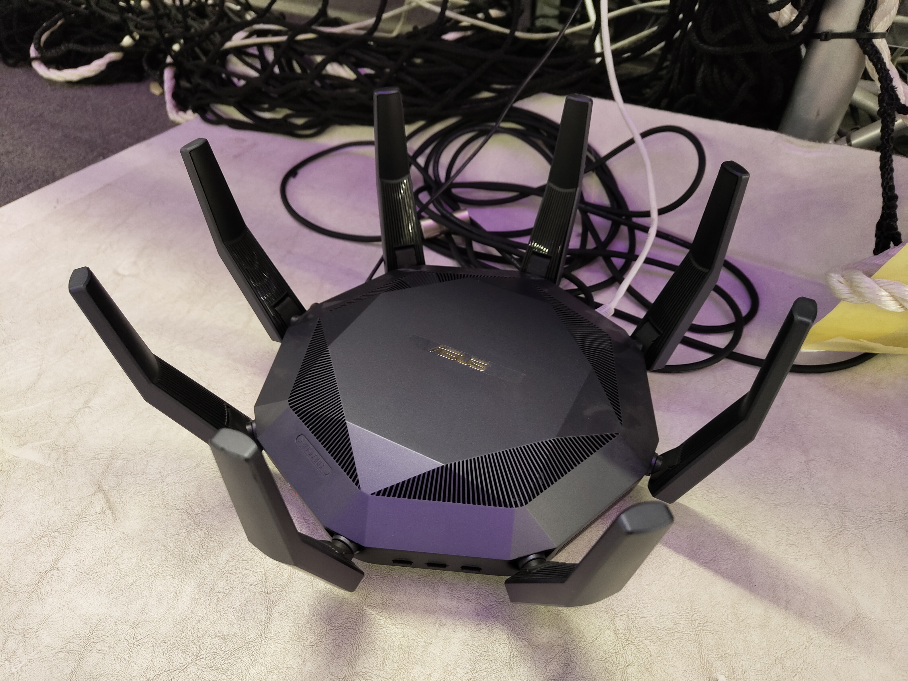

============
Vicon System
============

The Vicon motion capture system provides high-precision position tracking for robots, drones, and other objects in the KINESIS CTP Arena.

The Vicon system consists of:

- 24 high-speed cameras in the physical inventory
- 2 interconnected dedicated network switches
- :doc:`Intel NUC 11 Enthusiast Vicon PC </4-computing/workstations/vicon-pc>`
  running Tracker software
- Integration with Hermes wireless network

.. toctree::
   :maxdepth: 1
   :caption: Vicon Guides
   :hidden:

   arena-setup

How It Works
------------

1. **Capture**: the 24-camera array captures reflective markers from multiple angles
2. **Processing**: Vicon PC reconstructs 3D positions in real-time
3. **Broadcast**: Position data is transmitted over the :ref:`Hermes network <hermes-network>`
4. **Control**: Robots/drones use position data for navigation and control

Specifications
--------------

- **Capture volume:** 17 m × 6.4 m × 8 m, full Arena
- **Cameras:** 24 × Vicon Vantage V16, 16 MP, IR, 850 nm strobe
- **Position accuracy:** Sub-millimeter
- **Update rate:** Up to 120 Hz, configurable
- **Marker type:** Retro-reflective spherical markers, various sizes
- **Data output:** Vicon DataStream SDK, VRPN, C3D export

Network Architecture
--------------------

The Vicon system uses three distinct network paths:

- **Camera network:** Two interconnected PoE+ switches connect and power the 24-camera array.
  Switch 1 serves cameras 1–12 and Switch 2 serves cameras 13–24. The switches feed one active
  host Ethernet link and remain isolated from general laboratory traffic.
- :ref:`Hermes network <hermes-network>`: Dedicated position-data distribution from the Vicon
  PC to approved clients.
- :doc:`KINESIS CTP Network <../networks/index>`: General connectivity for data
  export and remote access.

.. _hermes-network:

Hermes Network
--------------

Hermes is the dedicated network used to distribute real-time Vicon position data from the
Vicon PC to approved robots, drones, and client computers in the Arena. It is not a
general-purpose laboratory network.

   Hermes network router

The Vicon PC receives camera data through the isolated camera network, reconstructs object
positions in Vicon Tracker, and distributes the resulting position data to authorised Hermes
clients through a dedicated network interface.

Connect a device to Hermes only while it requires Vicon position data. Disconnect it when the
Vicon task is complete. On Ubuntu or another NetworkManager-based Linux system:

.. code-block:: bash

   nmcli --ask device wifi connect "Hermes 5G"

Use ``Hermes 2.4G`` only when additional range is required. See the
:doc:`Arena Setup Guide <arena-setup>` for the complete Vicon preparation and test workflow.

- Use Hermes only for Vicon configuration, diagnosis, and position-data delivery.
- Do not use Hermes for internet access, general robot control, file transfers, software
  updates, or unrelated experiment traffic.
- Use :doc:`Networks & Connectivity <../networks/index>` for ordinary laboratory connectivity.
- Only authorised Vicon clients and users may connect.

Using the Vicon System
----------------------

See the :doc:`Arena Setup Guide <arena-setup>` for the operating workflow and the
:ref:`Hermes section <hermes-network>` for Vicon client connectivity.

Camera Power Management
-----------------------

The PoE switches supplying the motion-capture camera array are connected to
smart plugs managed through the :ref:`facility's Philips Hue controls
<workspace-lighting-system>`. Camera power can be controlled from the round
four-button Philips Hue switch at the Vicon Command Center or from the
**Vicon Cameras** control in the Philips Hue app. All four buttons on the
physical switch are assigned to Vicon camera power control.

.. important::

   Switch off the Vicon camera power circuit after each session. Re-enable it
   before the next session and allow the cameras to initialise before launching
   Vicon Tracker, Nexus, or Shōgun.

The **Vicon Cameras** control supplies power to the camera PoE switches; it is
not an Arena lighting control.
