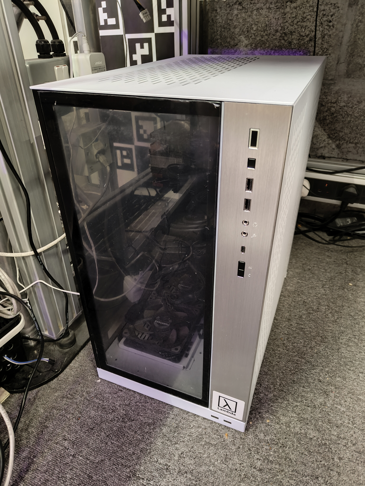

.. GENERATED FROM THE KINESIS VAULT — DO NOT EDIT THIS PAGE DIRECTLY.
.. equipment_id: 869fc34b-2491-4ee7-9620-2b5da43b444c

=======================
AI Workstation - Lambda
=======================

.. container:: equipment-kicker

   Lambda · Lambda Vector

   AI Workstation - Lambda

.. list-table:: At a glance
   :class: equipment-facts-table
   :widths: 32 68
   :header-rows: 0

   * - **Manufacturer**
     - Lambda
   * - **Model**
     - Lambda Vector
   * - **Equipment class**
     - PC
   * - **Location**
     - C3.B2.029.E (KINESIS CTP)
   * - **Quantity**
     - 1
   * - **Status**
     - Active

.. container:: equipment-booking-card

   **Check availability before planning**

   Review availability and reserve the equipment through the CTP Scheduling System.
   Access the system from the NYUAD network or through the VPN.

   .. container:: equipment-booking-actions

      `Book this equipment <https://corelabs.abudhabi.nyu.edu>`_

Overview
--------

A high-performance workstation PC equipped with advanced processing capabilities for artificial intelligence and data-intensive computing tasks.

Specifications
--------------

.. list-table::
   :class: equipment-spec-table
   :widths: 38 62
   :header-rows: 0

   * - **Operating system**
     - Ubuntu 22.04 LTS
   * - **Processor**
     - AMD Ryzen Threadripper PRO 5995WX (64 cores, 2.7-4.5 GHz)
   * - **Graphics / accelerator**
     - 2x NVIDIA RTX 6000 Ada Generation (48 GB each, 18176 CUDA cores and 568 Tensor cores per GPU)
   * - **System memory**
     - 512 GB
   * - **Storage**
     - 1.92 TB M.2 NVMe OS SSD and 3.84 TB U.2 NVMe data SSD (1 DWPD, PCIe 4.0)
   * - **Networking**
     - 2x 10 Gbps RJ45 Ethernet ports, 1x dedicated IPMI port, 2x2 Wi-Fi 6 (802.11 a/b/g/n/ac/ax) with Bluetooth v5.2
   * - **Additional specifications**
     - DDR4-3200 ECC RDIMM, PCIe 4.0

Keywords
--------

``workstation`` · ``PC`` · ``GPU`` · ``compute`` · ``AI`` · ``deep learning`` · ``data processing``

.. include:: /_includes/contact-lab-manager.inc
