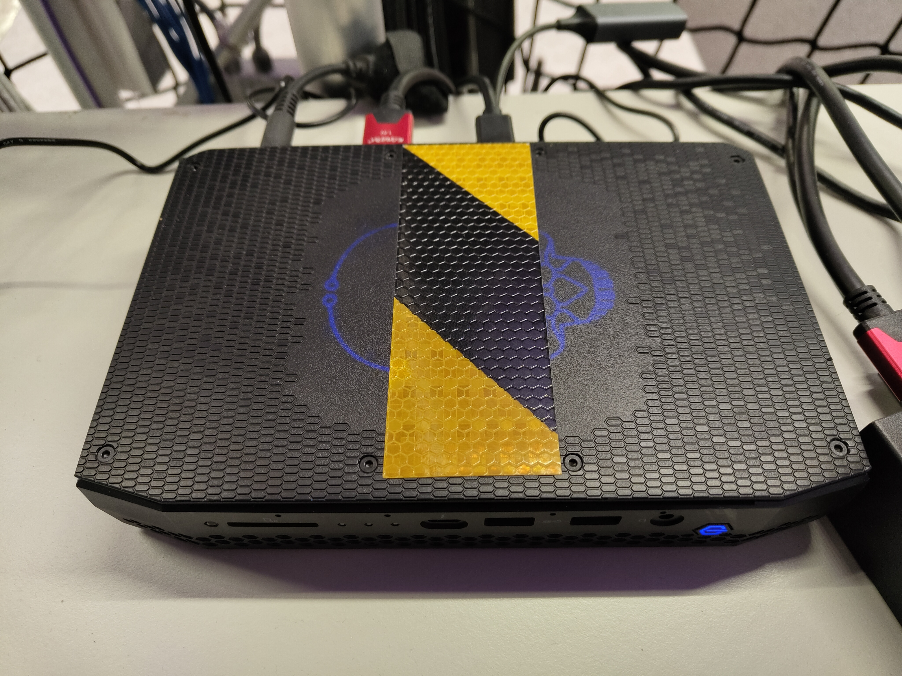

.. GENERATED FROM THE KINESIS VAULT — DO NOT EDIT THIS PAGE DIRECTLY.
.. equipment_id: cf587e8c-a3c7-414a-8118-d21a9c8b20b1

=======================================
Vicon Host PC - Intel NUC 11 Enthusiast
=======================================

.. container:: equipment-kicker

   Intel · NUC11PHKi7C

   Vicon Host PC - Intel NUC 11 Enthusiast

.. list-table:: At a glance
   :class: equipment-facts-table
   :widths: 32 68
   :header-rows: 0

   * - **Manufacturer**
     - Intel
   * - **Model**
     - NUC11PHKi7C
   * - **Equipment class**
     - PC
   * - **Location**
     - C3.B2.029.E (KINESIS CTP)
   * - **Quantity**
     - 1
   * - **Status**
     - Active
   * - **Training**
     - Not required
   * - **Risk assessment**
     - Not currently listed as required
   * - **Primary contact**
     - Samuel A. Prieto (sxp8070)

Overview
--------

Dedicated Intel NUC 11 Enthusiast mini PC that became the active Windows host for the KINESIS Vicon motion-capture and HERMES data-broadcast system on 2026-07-10.

Specifications
--------------

.. list-table::
   :class: equipment-spec-table
   :widths: 38 62
   :header-rows: 0

   * - **Operating system**
     - Microsoft Windows
   * - **Processor**
     - Intel Core i7-1165G7 (4 cores / 8 threads, up to 4.70 GHz)
   * - **Graphics / accelerator**
     - NVIDIA GeForce RTX 2060
   * - **Networking**
     - Intel I225-LM Ethernet; Intel Wi-Fi 6 AX201; ASIX USB Gigabit Ethernet adapter
   * - **Mobility**
     - Fixed
   * - **Operating environment**
     - Indoor

Typical workflows
-----------------

1. Running Vicon Tracker for real-time camera capture and object tracking
2. Broadcasting Vicon position data to robots and drones over HERMES
3. Recording, reviewing, and exporting motion-capture sessions

Software & dependencies
-----------------------

- Vicon Tracker
- Vicon DataStream SDK

Access, training & booking
--------------------------

Dedicated infrastructure host. Configuration, licensing, and network changes require lab-administrator approval.

Safety & operating limits
-------------------------

.. warning::

   - This computer is dedicated to the Vicon infrastructure.
   - Coordinate configuration, licensing, and network changes with the lab administrator.

**Environmental limits**

- Operate indoors only.

**Operational controls**

- Use only as part of its dedicated infrastructure configuration.

- **Software licence:** Required.

Related equipment & documentation
---------------------------------

- **Related documentation:** :doc:`Related system documentation </4-computing/vicon-system/index>`

Keywords
--------

``workstation`` · ``PC`` · ``compute`` · ``motion capture`` · ``Vicon`` · ``NUC`` · ``infrastructure``

.. include:: /_includes/contact-lab-manager.inc
