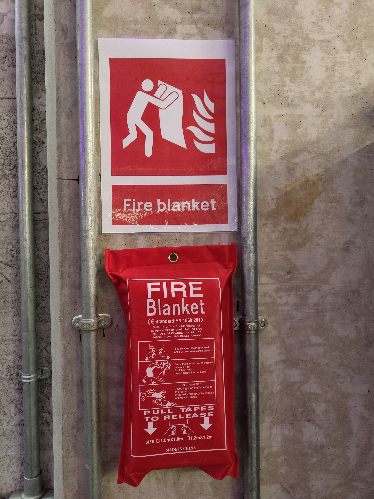

======
Safety
======

Safety Protocols
----------------

The KINESIS CTP Lab maintains strict safety protocols to protect personnel, equipment, and research activities.

General Safety Rules
--------------------

- Complete required safety and equipment training before access or operation.
- Follow posted safety instructions, equipment-specific RAs, applicable SOPs, and manufacturer instructions.
- Wear the exact attire and PPE specified for the activity; see the relevant equipment page and RA.
- Report incidents, near-misses, unsafe conditions, and equipment damage immediately.
- Keep emergency exits, fire blankets, extinguishers, and access routes clear at all times.

Arena Safety
------------

**Flight Operations:**

- Safety nets must be in place during flight tests
- Clear the area of unnecessary personnel
- Maintain visual line of sight with flying vehicles
- Have emergency stop procedures ready
- Use propeller guards when appropriate

**Ground Operations:**

- Establish safety perimeters for mobile robots
- Post warning signs for robot operation areas
- Ensure emergency stop buttons are accessible
- Test failsafe mechanisms before operations

Equipment Safety
----------------

**Electrical Safety:**

- Verify power requirements before connecting equipment
- Use appropriate circuit protection
- Keep liquids away from electrical equipment
- Report any damaged cables or connectors

**Battery Safety:**

- Use the :ref:`lipo-battery-charging-station` and never leave batteries charging unattended.
- Follow the battery-type storage location assigned by the lab manager; the charging station is not a storage area.
- Quarantine damaged or suspect batteries and email `nyuad.facilities@nyu.edu <mailto:nyuad.facilities@nyu.edu>`_ to coordinate disposal.

**Mechanical Safety:**

- Secure all equipment during operation
- Use appropriate guards on moving parts
- Follow weight limits for lifting equipment
- Maintain clear workspaces

.. _fire-safety-equipment:

Fire Safety Equipment
---------------------

   Fire Blanket and Safety Sign

The KINESIS CTP Lab has **two fire blankets** installed at strategic locations:

- **Near the main entrance** — Accessible immediately upon entering the lab
- **At the arena entrance column** — Located at the entry to the arena, immediately accessible during flight and robot operations

Fire blankets are emergency safety equipment, not a substitute for evacuation
or trained emergency response. For smoke, fire, venting, hissing, rapid heating,
or a leaking battery:

1. Do not handle the battery, open a charging container, or attempt to move it.
2. Alert everyone nearby, evacuate, and activate the fire alarm.
3. Call emergency services and NYUAD Campus Safety.
4. Use a fire blanket or extinguisher only if trained, the fire is still incipient,
   a clear exit remains behind you, and the applicable emergency procedure permits it.

All fire blankets are clearly signed and mounted in visible, accessible locations. Do not remove or relocate them.

Emergency Procedures
--------------------

**In Case of Emergency:**

1. Activate emergency stop if applicable
2. Alert personnel in the area
3. Call NYUAD Campus Safety at **+971 2 628 7777** when emergency assistance is required
4. Report incident to lab management

Risk Assessments
----------------

Every equipment item has a baseline RA for its approved use. A supplementary,
experiment-specific RA is required only when the planned activity introduces
hazards or material changes not covered by that baseline, such as a new
configuration, payload, material, operating area, human interaction, or
environment.

The current general lab and equipment Risk Assessments, together with the
lithium battery management SOP, are available on the :doc:`KINESIS Lab Safety
Documents </1-lab-overview/safety-documents>` page.

Training Requirements
---------------------

Required training varies by equipment and activity:

- General lab safety orientation
- Specific equipment training
- Emergency procedure familiarization
- PPE usage training

Incident Reporting
------------------

All incidents, no matter how minor, must be reported:

1. Notify lab management immediately
2. Document the incident
3. Participate in incident review
4. Implement corrective actions

Contact & Support
-----------------

.. include:: /_includes/contact-lab-manager.inc
